esbuild 的 API 有三种使用方式: 命令行、在 JavaScript 中执行、在 Go 语言中执行. 这三种方式所能接收的参数在大体上是一致的, 所以本篇文档的内容对这三种方式都是通用的.

esbuild 有两个主要的 API`transform`和`build`, 它们的工作方式是不同的, 所以你需要知道什么时候选择那一个 API 来使用

如果你使用的是 JavaScript, 请务必查看 JavaScript 部分, 如果你使用的是 Typescript, 请务必查看 Typescript 部分, 如果你使用的是 Go, 可以在 Go Document 部分查看详细的使用文档

## Transform API

transform api 可以在无法访问文件系统的时候, 传入一个字符串作为参数, 这种特性适用于在没有文件系统的环境中使用, 比如浏览器或者其他工具链中使用, 像这样:

```shell
$ echo 'let x: number = 1' | esbuild --loader=ts
let x = 1;
```

```javascript
require("esbuild").transformSync("let x: number = 1", {
  loader: "ts",
});
```

编译后:

```javascript
{
  code: 'let x = 1;',
  map: '',
  warnings: []
}
```

在命令行中使用 esbuild 的时候, 如果没有提供传入文件, 将会使用 transform API

### 基础选项

[Define](#define)
[Format](#format)
[Loader](#loader)
[Minify](#minify)
[Platform](#platform)
[Sourcemap](#sourcemap)
[Target](#target)

### 高级选项

[Banner](#banner)
[Charset](#charset)
[Color](#color)
[Drop](#drop)
[Footer](#footer)
[Global name](#globalnames)
[Ignore annotations](#ignoreannotations)
[JSX](#jsx)
[JSX dev](#jsxdev)
[JSX factory](#jsx-factory)
[JSX fragment]()
[JSX import source]()
[JSX side effects]()
[Keep names](#keepnames)
[Legal comments](#legalcomments)
[Log level](#loglevel)
[Log limit](#loglimit)
[Log override](#logoverride)
[Mangle props](#mangleprops)
[Pure](#pure)
[Source root](#sourceroot)
[Sourcefile](#sourcefile)
[Sources content](#sourcecontent)
[Supported](#supportted)
[Tree shaking](#treeshaking)
[Tsconfig raw](#tsconfigrow)

## Build API

`build` API, 用来打包文件系统中的一个或多个文件, 并且允许把文件中引入的其他模块打包到一起

默认情况下, build 不会把入口文件中引用的其他文件打包到一起, 如果需要, 必须给 build 函数添加`bundle:true`或者在命令行上添加`--bundle`参数

### 基础选项

[Alias]()
[Bundle](#bundle)
[Define](#define)
[Entry points](#entry-points)
[External](#external)
[Format](#format)
[Inject](#inject)
[Loader](#loader)
[Minify](#minify)
[Outdir](#outdir)
[Outfile](#outfile)
[Platform](#platform)
[Serve](#serve)
[Sourcemap](#sourcemap)
[Splitting](#splitting)
[Target](#target)
[Watch](#target)
[Write](#write)

### 高级选项

[Allow overwrite](#allowoverwrite)
[Analyze](#analyze)
[Asset names]()
[Banner](#banner)
[Charset](#charset)
[Chunk names](#chunknames)
[Color](#color)
[Conditions](#conditions)
[Drop](#drop)
[Entry names](#entrynames)
[Footer](#footer)
[Global name](#globalnames)
[Ignore annotations](#ignoreannotations)
[Incremental](#incremental)
[JSX](#jsx)
[JSX dev](#jsxdev)
[JSX factory](#jsx-factory)
[JSX fragment]()
[JSX import source]()
[JSX side effects]()
[Keep names](#keepnames)
[Legal comments](#legalcomments)
[Log level](#loglevel)
[Log limit](#loglimit)
[Log override](#logoverride)
[Main fields](#mainfield)
[Mangle props](#mangleprops)
[Metafile](#metafile)
[Node paths](#nodepaths)
[Out extension](#outextension)
[Outbase](#outbase)
[Preserve symlinks](#preservesymlinks)
[Public path](#publicpath)
[Pure](#pure)
[Resolve extensions](#resolveextensions)
[Source root](#sourceroot)
[Sourcefile](#sourcefile)
[Sources content](#sourcecontent)
[Stdin](#stdin)
[Supported](#supportted)
[Tree shaking](#treeshaking)
[Tsconfig](#tsconfig)
[Working directory](#tsconfigrow)

## API Options

### Bundle

[ build ]

bundle 选项意味着会把任何的依赖都打包到最终的文件内, 这个过程是递归进行的, 所以依赖项的依赖项都会被打包到最终文件内, 默认情况下, esbuild 不会打包依赖项

需要注意的是, 如果 entryfile 有多个文件, esbuild 也会创建多个单独的包, 且它们依赖的文件会同时存在与这些最终包文件内. (多个文件时, 一般需要设置 outdir 属性才行)

#### 非静态导入

esbuild 只会处理静态导入的包, 那些非静态导入的(条件编译,带有变量)不会被打包, 比如:

```javascript
// 带有编译条件的
if(true){
  import 'a-module';
}

// 带有变量的
import `${name}-module`
```

在 esbuild 中解决此类问题的方法, 是通过`external`选项把这种包标记为"外部包", 但是你需要确保真正的运行环境中必须安装了这个包.

> 类似于 webpack 这种打包工具, 试图把所有可能用到的包都打包到最终包文件中, 但是 esbuild 不会处理这种问题, 如果你需要执行这类操作, 那么你需要的可能不是 esbuild

### Entry Points

[ build ]

入口点, 它的值是一组文件路径, 简单的应用程序只需要一个入口文件, 但是如果有多个逻辑上独立的功能区域, 会采用多个入口点来进行打包. 单一的入口点会有助于减少浏览器请求的次数. 最简单的方式是传入一个包含文件路径的数组, 就像这样:

```Javascript
require('esbuild').build({
  entryPoints: ['main.ts','setting.ts'],
  bundle: true,
  write: true,
  outdir: 'out',
})
```

这份配置将会生成两个打包文件:`out/main.js`与`out/setting.js`.

如果想进一步配置打包文件输出的路径或其他选项, 可以参考[Entry names]() [Out extension]() [Outbase]() [Outdir]() [Outfile]()选项.

比如你也可以给 entry points 传递一个对象来控制输出文件:

```Javascript
require('esbuild').buildSync({
  entryPoints: {
    out1: 'home.ts',
    out2: 'settings.ts',
  },
  bundle: true,
  write: true,
  outdir: 'out',
})
```

这次输出的打包文件会变成`out/out1.js`与`out/out2.js`

### Outbase

[ build ]

如果你的多个入口文件分别位于不同的目录中, 这个选项用来帮助你把入口文件的相对路径复制到输出路径中. 假如有两个入口文件`src/pages/home/index.ts`与`src/pages/about/index.ts`, 如果你的`outbase=src`, 那么它们构建后的保存位置将会是`pages/home/index.js`与`pages/about/index.js`, 当然了这两个输出路径都是在`outdir`目录内的. 就像这样:

```shell
esbuild src/pages/home/index.ts src/pages/about/index.ts --bundle --outdir=out --outbase=src`
```

或者

```javascript
require("esbuild").buildSync({
  entryPoints: ["src/pages/home/index.ts", "src/pages/about/index.ts"],
  bundle: true,
  outdir: "out",
  outbase: "src",
});
```

如果没有指定该选项, 那么 esbuild 会默认它的值是所有入口文件的最近的相同目录, 在上面的案例中, 这个默认值会被设置为`src/pages`.

### Outdir

[ build ]

outdir 用来设置输出文件的保存目录, 像这样:

```javascript
require("esbuild").buildSync({
  entryPoints: ["app.js"],
  bundle: true,
  outdir: "out",
});
```

如果这个目录不存在, 会被自动创建. 但是如果这个文件内已经包含某些文件, 再次打包时 esbuild 不会自动清理里面的旧文件, 新的同名文件会自动覆盖旧文件. 所以, 如果你希望输出目录只包含最新的打包文件时, 需要在运行 esbuild 之前手动清理删除目录

如果你拥有多个入口文件, 通过每个入口文件打包后的文件都会放在`outdir`目录中

### OutFile

[ build ]

outfile 用来设置最终输出文件的文件名, 这个选项只有在单个入口文件时才有效. 如果你有多个入口文件, 必须使用`outdir`选项设置打包文件的保存目录

```javascript
require("esbuild").buildSync({
  entryPoints: ["app.js"],
  bundle: true,
  outfile: "out.js",
});
```

### Target

[ build | transform ]

这个选项用来设置构建后的 javascript 或者 css 文件的目标运行环境, 它会告诉 esbuild 如何把新的语法转换成目标环境能够正常执行的旧语法. 例如`??`是 Chrome80 版本中才引入的语法, 因此针对更早版本的 chrome, esbuild 会把`??`转换成旧版本的语法,虽然旧版本的语法显得更冗长, 但它们的作用是一致的.

注意 esbuild 这种转换功能只与语法有关, 与 JavaScript 的 API 无关, esbuild 不会为新的 JavaScript API 自动添加 polyfill, 如果需要你必须自己显式导入相关的 polyfill, (这是因为自动导入 polyfill 功能不在 esbuild 的功能范围内)

该选项的每个值都是一个环境名称后跟一个版本号的形式, 目前 esbuild 支持下面几种值:

- chrome
- deno
- edge
- firefox
- hermes
- ie
- ios
- node
- opera
- rhino
- safari

此外你还可以直接指定 JavaScript 的版本号, 比如`es2020`等, 默认的 JavaScript 版本号是`esnext`, 这意味着 esbuild 将会假定支持所有最新的 JavaScript 语法与 CSS 语法, 如果你需要配置多个目标环境, 可以像这样:

```javascript
require("esbuild").buildSync({
  entryPoints: ["app.js"],
  target: ["es2020", "chrome58", "edge16", "firefox57", "node12", "safari11"],
  outfile: "out.js",
});
```

设置这些值的时候, 你可以只关心你的项目所运行的具体目标环境, 甚至可以具体到更为精细的版本号, 比如`node12.19.0`.

哪些版本具体支持哪些语法特性, 你可以参考[JavaScript Loader]() 部分. 需要注意的是虽然`es2020`是按年份标记的版本, 但它表示该规范在 2020 年获得批准, 并不是浏览器实现该规范的年份.

如果你使用了 esbuild 尚不支持的语法, esbuild 将会在编译过程中抛出错误, 比如你的 target 设置为`["es5"]`, 源代码中却使用了`const`关键字, esbuild 将会抛出错误并且中止执行, 就像这样:

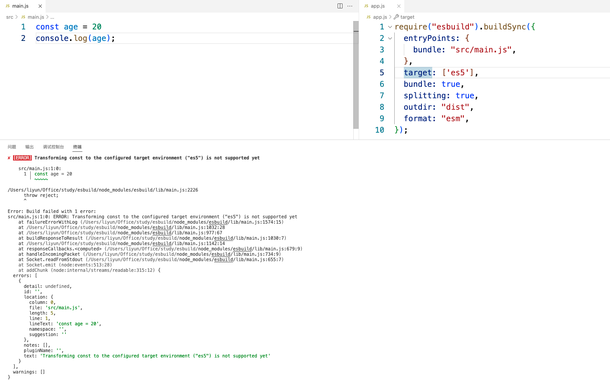

这是因为 esbuild 仅支持把新的 JavaScript 语法转换到 ES6 的语法

如果你想自定义 esbuild 对于语法转换的规则, 可以使用[supported](#supported)选项

### Platform

[ build | transform ]

(这节部分文档可能与官方不是完全相同, 但每句话都是经过我实践之后翻译出来的)

默认情况下, esbuild 的设置是让文件在浏览器中运行, 如果你希望打包文件能够运行在 NodeJS 环境中, 应当手动把`platform`设为`node`, 像这样:

```javascript
require("esbuild").buildSync({
  entryPoints: ["app.js"],
  bundle: true,
  platform: "node",
  outfile: "out.js",
});
```

当`platform`使用为`browser(默认值)`时:

1. 如果设置了`--bundle`参数, `format`选项会默认被设置为`iife`. 生成的代码会被包含在一个立即执行函数中, 以防止变量泄露到全局范围内
2. `mainFields`会被自动设置为`browser, module, main`
3. 如果某个引入包的`package.json`文件中有`browser`字段, esbuild 会使用`browser`字段提供的对浏览器更为友好的文件
4. 如果某个引入包的`package.json`文件中只有`main`与`module`字段, esbuild 会优先选择`module`指定的文件
5. [Conditions](#conditions)选项会自动添加`browser`值, 这会配合`package.json`中`export`字段的值选择更适合浏览器的文件
6. 当启用了所有的 minify 选项时, `process.env.NODE_ENV`会被全局替换为`production`, 否则会被设置为`development`. 要注意此行为只会在`process`、`process.env`或者`process.env.NODE_ENV`没有明确定义时才会执行

译者案例:

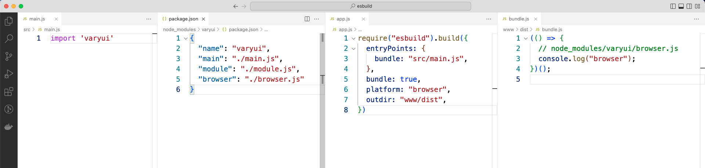

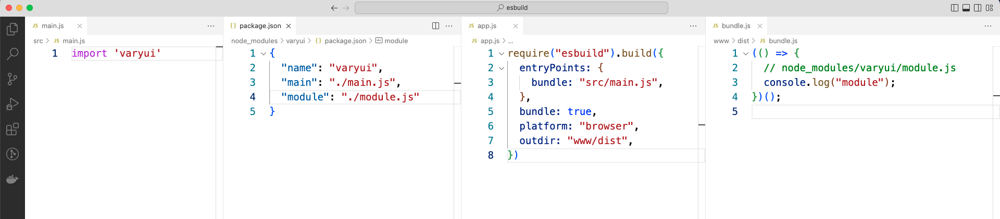

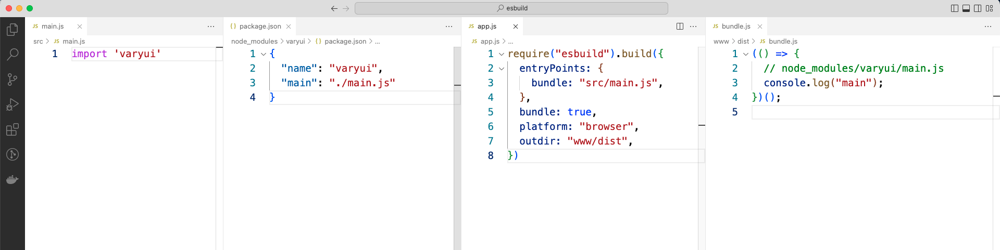

当`platform`使用为`node`时:

1. 如果设置有`--bundle`参数, `format`选项会默认被设置为`cjs`.
2. [mainFields](#mainfields)`会被自动设置为`module, main`(也就是说只检查模块的这两个字段, 如果都没有, esbuild 会报错)
3. 如果某个引入包的`package,json`文件中既有`main`又有`module`字段, esbuild 会优先选择`main`指定的文件, 没有`main`字段时才会选择`module`指定的文件
4. `package.json`中设置的`browser`字段在`platform=node`时,它对应的文件永远也不会被采取
5. 所有 Nodejs 内置的模块, 比如`fs`模块, 都会被自动标记为`external(外部模块)`
6. [Conditions](#conditions)选项会自动添加`node`值, 这会配合`package.json`中`export`字段的值选择更适合 NodeJS 环境的文件

译者案例:

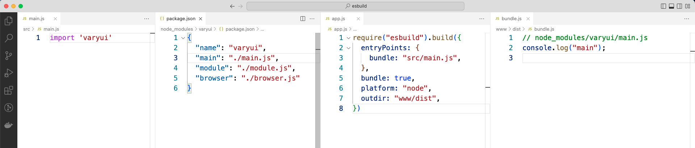

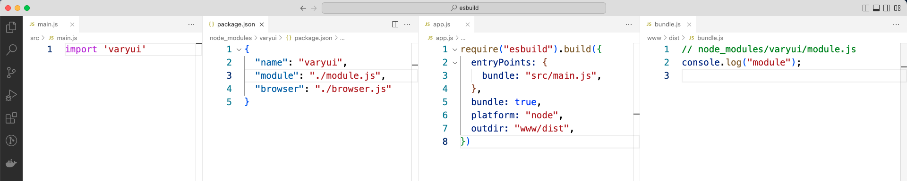

当`platform`使用为`neutral`时:

1. 如果设置有`--bundle`参数, `format`选项会默认被设置为`esm`. 如果这个格式不是你想要的, 你可以手动指定[format](#format)选项的值
2. [mainFields](#mainfields)会被自动设置为空值, 如果你想改变这个行为, 可以手动设置它的值
3. [conditions](#conditions)选项的值也会被自动设置为空值.

### MainField

[ build ]

当你在 Node 环境中导入一个包, 该包的`package.json`文件中的`main`字段指定了要导入真实文件路径. 该选项用来告诉 esbuild 应该从`package.json`的哪个字段中获取真实的路径, 通常来说有三个常用的值.

- `main`
  这是所有包的标准字段, 这个字段适用于 NodeJS 环境, 一般来说, 它对应的文件路径应当是一个 CommonJS 模块
- `module`
  这是一个来自[ECMAScript 的提案](https://github.com/dherman/defense-of-dot-js/blob/f31319be735b21739756b87d551f6711bd7aa283/proposal.md), 因此一般来说它对应的文件应当是一个 ESM 模块. 这个提案没有被 Node 采用, 但是它被很多构建工具支持, 因为这种模块有利于 tree shaking 或者移除无效代码.  
  一些作者可能会将`module`字段对应的路径设置为运行于浏览器的模块文件, 将`main`字段对应的路径设置为运行于 Node 环境的模块文件, 这可能是因为 Node 会默认忽略`module`字段, 且人们通常只会把需要在浏览器中运行的项目进行打包. 然而, 对于 Node 环境中运行的代码来说, 重新打包也是很有用的, 它能够有效的减少下载和启动时间. 把在浏览器中运行的代码放进`module`字段中, 也会阻止打包器更有效的进行 tree shaking. 因此, 如果你尝试在发布的模块中包含在浏览器中运行的代码, 请尽可能使用`browser`字段
- `browser`
  这个字段也来自一个[提案](https://gist.github.com/defunctzombie/4339901/49493836fb873ddaa4b8a7aa0ef2352119f69211), 这个提案中允许在这个字段中指定对浏览器环境更友好的文件路径, 一个模块可以同时使用`module`与`browser`字段

该参数的默认值取决于[platform](#platform)选项的值, 对于`platform=browser`来说, 它的默认值是`['brower','module','main']`, 对于`platform=node`来说它的默认值是`['main','module']`, 如果你想自定义, 可以像下面这样:

```shell
esbuild app.js --bundle --main-fields=module,main
```

或者

```javascript
require("esbuild").buildSync({
  entryPoints: ["app.js"],
  bundle: true,
  mainFields: ["module", "main"],
  outfile: "out.js",
});
```

For package authors: If you want to author a package that uses the browser field in combination with the module field to fill out all four entries in the full CommonJS-vs-ESM and browser-vs-node compatibility matrix, you want to use the expanded form of the browser field that is a map instead of just a string:(译者: 这段实在看不出来它有啥用)

```javascript
{
  "main": "./node-cjs.js",
  "module": "./node-esm.js",
  "browser": {
    "./node-cjs.js": "./browser-cjs.js",
    "./node-esm.js": "./browser-esm.js"
  }
}
```

### Format

[ build | transform ]

这个选项用来设置最终打包文件的语法格式, 这里提供了三种常见的值`iife`,`cjs`,`esm`.

在没有指定该选项时, 如果添加了`--bundle`参数, esbuild 会自动选择一种输出格式, 如果没有`--bundle`参数, esbuild 不会进行任何格式转换

#### IIFE

配置为`iife`时, 表示 esbuild 会输出一个立即执行函数, 通常意味着这种文件会在浏览器中运行, 立即执行函数的代码可以确保代码中的任何变量不会与全局变量发生冲突. 如果你的[target(运行环境)](#target)选项中只包含了浏览器模式, 且指定了`--bundle`参数的时候, esbuild 会自动使用`iife`模式. 你也可以手动指定为`iife`作为`Format`选项的值, 像这样:

```javascript
let js = 'alert("test")';
let out = require("esbuild").transformSync(js, {
  format: "iife",
});
process.stdout.write(out.code);
```

#### CJS

CJS 是 CommonJS 的缩写, 意味着希望打包后的脚本运行在 NodeJS 环境中, 它会假定你的环境支持`exports`,`module`,`require`等语法. 如果你的[target(运行环境)](#target)设置为`node`, 且指定了`--bundle`参数的时候, esbuild 会自动使用`cjs`模式. 你也可以手动指定为`cjs`作为`Format`选项的值, 像这样:

```javascript
let js = 'export default "test"';
let out = require("esbuild").transformSync(js, {
  format: "cjs",
});
process.stdout.write(out.code);
```

如果你的入口文件是 ESM 模块, esbuild 也会自从把它转成 CommonJS 模块, 像这样:

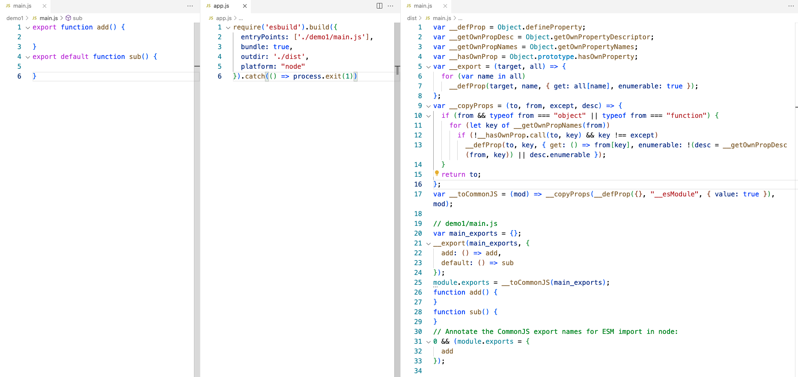

#### ESM

ESM 实际上指的是 ECMAScript 中的模块, 它会假定你的环境中支持`import`,`export`语. 如果你的[platform(运行平台)](#platform)设置为`neutral`, 且指定了`--bundle`参数的时候, esbuild 会自动使用`esm`模式. 你也可以手动指定为`esm`作为`Format`选项的值, 像这样:

```javascript
let js = 'module.exports = "test"';
let out = require("esbuild").transformSync(js, {
  format: "esm",
});
process.stdout.write(out.code);
```

esm 格式表示既可以在浏览器中使用, 也可以在 node 中使用, 在浏览器中, 你可以使用`<script file="bundle.js" type="module"></script>`来加载模块. 如果你想在 Node 中使用 esm 模块, 必须启用`--experimental-modules`选项, 且必须使用`.mjs`后缀, 比如`node --experimental-modules bundle.mjs`

如果你的入口文件是一个 CommonJS 模块, 会被转换为一个`export default`模块, 像这样:

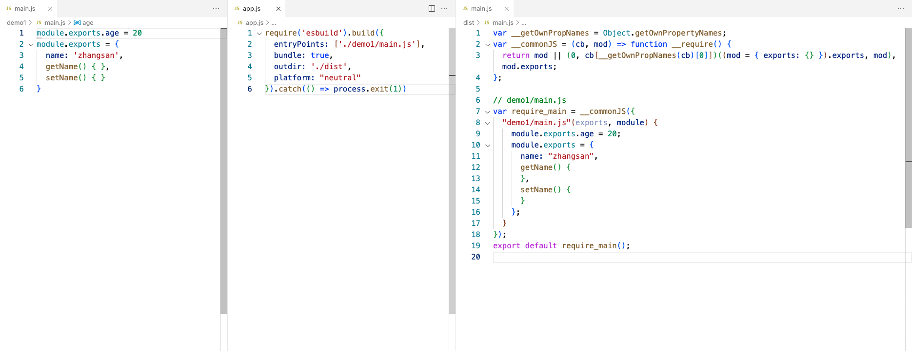

> 注意看`__commonJS`部分 , esbuild 通过自己实现的一个函数模拟出了`module`,`export`的概念, 从而把 CommonJS 格式的模块, 转为一个 ESM 模块

### Define

[ build | transform ]

用来定义一些全局常量, 这些常量会在打包过程中替换代码中出现的指定字符

```javascript
let js = 'hooks = DEBUG && require("hooks")';
require("esbuild").transformSync(js, {
  define: { DEBUG: "true" },
});
// 注意这里: 因为DEBUG的值为true, 所以hooks的值直接=require('hooks')
// {
//   code: 'hooks = require("hooks");\n',
//   map: '',
//   warnings: []
// }

require("esbuild").transformSync(js, {
  define: { DEBUG: "false" },
});
// 这里因为DEBUG的值为false, 所以hooks表达式的值被编译为hooks=false
// {
//   code: 'hooks = false;\n',
//   map: '',
//   warnings: []
// }
```

define 的值, `必须是一个标准的 JSON 对象`(null, boolean, number, string, object, array). 其中 null, boolean, number, string 会在编译过程中直接替换, object 与 array 会以引用的方式替换, 就像这样:

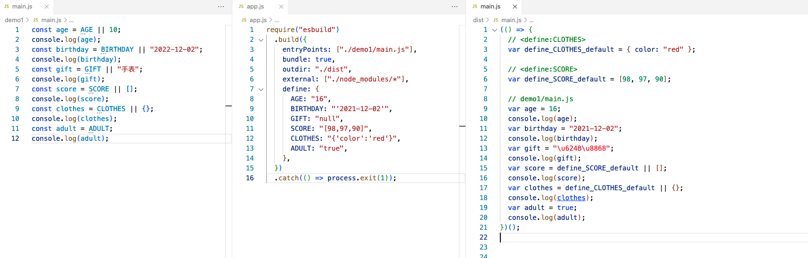

如果你是命令行, 可以这么写:

```shell
"esbuild --define:process.env.NODE_ENV=\\\"production\\\" app.js
```

需要注意的是, 无论是 windows 还是 bash 中, 都要使用`\`转义你的特殊字符, 才能被 `define` 正确识别. 如果在使用 shell 的过程中依然遇到转义问题, 可以改用 JavaScript 的 API 来消除不同平台之间的差异

### External

[ build ]

你可把某个文件或者某个模块标记为`external (外部的)`, 从而让这个文件或模块不会被打包到最终文件中.

看这个例子:

```Javascript
// demo/lib.js
export function sayHello() {
  console.log('Hello esbuild!')
}

// demo/main.js
import { sayHello } from './lib'

sayHello()

// app.js
require('esbuild').build({
  entryPoints: ['./demo1/main.js'],
  bundle: true,
  outdir: './dist',
  external: ['./lib'],
}).catch(() => process.exit(1))

// dist/main.js (bundle file)
(() => {
  var __require = /* @__PURE__ */ (
    (x) => typeof require !== "undefined"
      ? require
      : typeof Proxy !== "undefined"
        ? new Proxy(x, {
          get: (a, b) => (typeof require !== "undefined" ? require : a)[b]
        })
        : x)(
          function (x) {
            if (typeof require !== "undefined")
              return require.apply(this, arguments);
            throw new Error('Dynamic require of "' + x + '" is not supported');
          }
        );

  // demo1/main.js
  var import_lib = __require("./lib");
  (0, import_lib.sayHello)();
})();
```

从这个案例中可以看处理, 输出的打包文件中并没有包含`lib.js`中的源代码, 而是以`require`的方式从外部引入.

`external`参数也可以使用通配符来匹配多个文件, 像这样:

```Javascript
require('esbuild').buildSync({
  entryPoints: ['app.js'],
  outfile: 'out.js',
  bundle: true,
  external: ['*.png', '/images/*'],
})
```

`external`用来查找源代码中导入的包路径或者文件系统中的绝对路径, 如果导入的路径符合以下任意一种条件, 都会被视为外部文件

1. 如果外部路径看起来像一个包路径(不是以`/`,`./`,`../`开头的), 那么所有以该路径为开头的导入路径都会被认作外部文件, 也就是说如果你配置了`external=@vue`, 那么文件中所有的类似于`@vue/add`或者`@vue/sub`的路径都会认为是外部文件

2. 如果导入路径看起来像是文件系统路径(以`/`,`./`,`../`开头的), 那么所有以该路径为开头的导入路径,也会被认做外部文件, 比如说你配置了`external=./dir/*`, 那么文件中所有类似于`./dir/add`或者`./dir/sub`的路径 也都会被认为是外部文件

这两类路径对应的文件, 都不会出现在最终打包文件内.

### Inject

[ build ]

inject 可以允许你通过导入一个文件来替换全局变量, 像这样:

```javascript
// main.js
process.cwd();

// shim.js
require("esbuild")
  .build({
    entryPoints: ["./demo1/main.js"],
    bundle: true,
    outdir: "./dist",
    inject: ["./demo1/shim.js"],
  })
  .catch(() => process.exit(1));

// dist/main.js (bundle file)
(() => {
  // demo1/shim.js
  var process = {
    cwd() {},
  };

  // demo1/main.js
  process.cwd();
})();
```

你应该知道`process.cwd`是一个只能在 NodeJS 环境中使用的函数, 如果用户不小心把在浏览器中使用了这个函数, 浏览器会抛出一个错误, `inject`让 esbuild 在打包的过程中注入了另一个`process.cwd`方法, 来避免这个问题

甚至你还可以让 inject 与 define 结合起来一起使用, 让这种替换行为更清晰, 像这样:

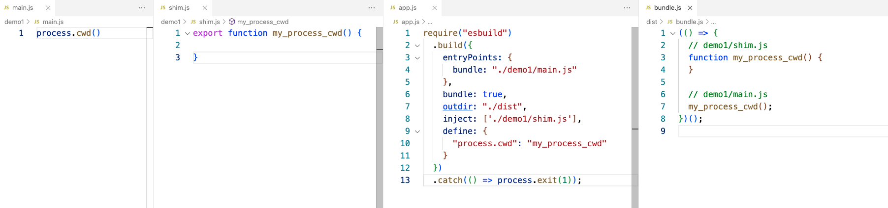

从案例中可以看出来, esbuild 直接把`process.cwd`字符串替换为`my_process_cwd`, 然后又使用了 inject 中注入的`my_process_cwd`函数, 来实现避免 `process.cwd`在浏览器中抛出错误的问题

### Loader

[ build | transform ]

### Minify

[ build | transform ]

这个选项启用时, 生成的代码将被压缩, 压缩后的代码会比压缩之前占用的控件更小, 这意味着它的下载速度会更快, 但是增加了调试难度, 所以通常只会在生产环境中启用这个选项

```javascript
// demo/main.js
function add() {
  console.log("add");
}
add();

// bundle.js
(() => {
  // demo1/main.js
  function add() {
    console.log("add");
  }
  add();
})();

// bundle.min.js
(() => {
  function d() {
    console.log("add");
  }
  d();
})();
```

可以看出来压缩和未压缩模式所生成的代码是不一样的(我的 markdown 配置了自动格式化, 实际上`bundle.min.js`中的代码应该是以不换行的形式出现的)

minify 选项主要负责以下几种工作:

1. 删除了代码中的空格及换行,
2. 重写代码中的某些语法, 使其更加紧凑
3. 重命名了局部变量,使代码更简洁

你也可以自行配置这些工作,让 minify 的控制更为精准

```javascript
{
  minifyWhitespace: boolean; //  是否清除空格
  minifyIdentifiers: boolean; // 是否清除缩进
  minifySyntax: boolean; // 是否压缩语法
}
```

同时, minify 不止会压缩 JavaScript 代码, 它对 CSS 代码同样适用.

esbuild 的压缩算法会生成一个非常接近行业标准 JS 压缩工具产生的文件, esbuild 可能并不是最佳的 JS 压缩工具, 但它正在努力尝试向最优的压缩工具前进.

#### 注意事项

在使用 esbuild 的压缩选项时, 有几点是需要注意的:

1. 但启用压缩选项时, 通常应当搭配`target`使用, 默认情况下, esbuild 会使用更为先进的语法来缩小你的代码量. 比如`a === undefiend || a === null ? 1 : a`会被压缩成`a ?? 1`.(`??`是[空值合并运算符](https://developer.mozilla.org/docs/Web/JavaScript/Reference/Operators/Nullish_coalescing)). 如果你不希望 esbuild 在压缩式使用最新的 JS 语法来压缩代码, 可以把`target`设置为`es6`

2. 转义字符`\n`将会被替换为真正的换行符(字符串中的`\n`会被换成换行符, 这个换行符是不可见字符), 这样也会减少打包文件的大小, 因为`\n`需要占用两个字节, 而换行符只需要占用一个字节

3. 默认情况下, esbuild 不会压缩顶级声明, 这是因为 esbuild 并不知道你要以何种方式使用最终的打包文件. 比如说如果你要把最终的打包文件作为另一份代码中的一部分去使用, 如果这些顶级声明也被 minify 处理了, 会导致某些引用执行失败或者抛出错误.

4. esbuild 在压缩代码的时候, 不会保存函数有 class 的 name 属性值, 比如:

```javascript
// main.js
function add() {}
console.log(add.name);

// app.js
require("esbuild")
  .build({
    entryPoints: {
      bundle: "./demo1/main.js",
    },
    bundle: true,
    outdir: "./dist",
    minify: true,
  })
  .catch(() => process.exit(1));

// bundle.min.js
(() => {
  function n() {}
  console.log(n.name);
})();
```

使用`node dist/bundle.min.js`输出时, 会发现并没有输出我们希望的`add`, 而是输出了`n`, 而`n`是压缩后的函数名.

因为大多数的代码用不到函数或者类的`name`属性, 所以 esbuild 默认情况下没有保留`name`属性值. 但是某些代码确实需要该属性来进行注册和绑定, 如果你确定需要保留这个特性, 可以使用`keepNames`选项, 像这样:

```javascript
// main.js
function add() {}
console.log(add.name);

// app.js
require("esbuild")
  .build({
    entryPoints: {
      bundle: "./demo1/main.js",
    },
    bundle: true,
    outdir: "./dist",
    minify: true,
    keepNames: true,
  })
  .catch(() => process.exit(1));

// bundle.min.js
(() => {
  var c = Object.defineProperty;
  var n = (o, a) => c(o, "name", { value: a, configurable: !0 });
  function d() {}
  n(d, "add");
  console.log(d.name);
})();
```

可以看到, 打包后的文件中使用`defineProperty`函数给原有函数添加了静态属性`name`, 现在通过`node dist/bundle.min.js`执行后输出的就是预期中的`add`了

5. esbuild 与其他的压缩器一样, 并不是百分百安全的. 与函数与类的`name`属性类似, minify 也印象函数的`toString()`方法, esbuild 不会保留`FunctionName.toString()`的返回值, 像这样:

```javascript
// main.js
function add() {
  console.log("add");
}
console.log(add.toString());
// app.js
require("esbuild")
  .build({
    entryPoints: {
      bundle: "./demo1/main.js",
    },
    bundle: true,
    outdir: "./dist",
    minify: true,
  })
  .catch(() => process.exit(1));

// bundle.min.js
(() => {
  function o() {
    console.log("add");
  }
  console.log(o.toString());
})();
```

通过`node dist/bundle.min.js`执行后,发现输出的内容是`function o(){console.log("add")}`, 如果没有开启 minify, 输出的内容则是`function add() {console.log("add");}`, 这种变化看起来没什么用, 但在 AngularJS 中会受到严重影响, 因为 AngularJS 会使用`toString()`函数去解析函数的参数名称来实现某些功能

6. 某些 JS 语法可能会影响 esbuild 的压缩功能, 比如`eval`, 像这样:

```javascript
// main.js
eval("console.log('zhangsan')");
function add() {
  console.log("add");
}
add();
// app.js
require("esbuild")
  .build({
    entryPoints: {
      bundle: "./demo1/main.js",
    },
    bundle: true,
    outdir: "./dist",
    minify: true,
  })
  .catch(() => process.exit(1));

// bundle.min.js
(() => {
  var d = (a, o) => () => (o || a((o = { exports: {} }).exports, o), o.exports);
  var n = d((exports, module) => {
    eval("console.log('zhangsan')");
    function add() {
      console.log("add");
    }
    add();
  });
  n();
})();
```

在`bundle.min.js`中可以看到, 源代码中的`eval`语句, 导致整个模块都没有被 esbuild 的 minify 执行. `eval`之外`with`也会导致此类问题, 但幸好`with`已经[不被建议使用](https://developer.mozilla.org/docs/Web/JavaScript/Reference/Statements/with)了

7. esbuild 的 minify 目前不会对代码进行高级优化, 比如下面这些优化项:

- Dead-code elimination within function bodies (移除无用代码)
- Function inlining (把某些函数移到调用点来减少函数调用)
- Cross-statement constant propagation
- Object shape modeling
- Allocation sinking
- Method devirtualization
- Symbolic execution
- JSX expression hoisting
- TypeScript enum detection and inlining

如果你希望在压缩过程中使用这些优化方案,你可以考虑使用其他的一些支持高度优化的技术方案,比如`Terser`或者`Google Closure Compiler`

### KeepNames

当[minify](#minify)选项打开后, esbuild 会改变 `function` 和 `class` 的 `name` 属性值, 但是某些框架需要依赖 `function` 或者 `class` 的 `name` 属性来进行注册或者绑定, 在这种情况下, 你可以开启当前选项来保留原始的 `name` 属性值, 用法像这样:

```shell
$ esbuild app.js --minify --keep-names
```

```javascript
require("esbuild").buildSync({
  entryPoints: ["app.js"],
  minify: true,
  keepNames: true,
  outfile: "out.js",
});
```

### Sourcemap

[ build | transform ]

sourcemap 主要功能是方便调试代码. 如果你生成的代码与源代码差别很大, 比如你使用了 Typescript 或者启用了[minify](#minify)选项, 这将是很有用的

javascript 与 css 都支持 sourcemap 功能, sourcemap 支持 4 中映射模式:

#### 使用 sourcemap

在浏览器中, 只要启用了 javascript source map 功能, 浏览器的开发者工具就会自动获取映射代码.

在 Node 中, 从版本 v12.12.0 开始原生支持 sourcemap 功能. 但是默认情况下该功能是被禁用的, 通过`--enable-source-map`参数可以启用该功能, 像这样:

```shell
node --enable-source-maps app.js
```

#### linked

这种模式下,与打包文件同级目录中回生成一个`*.map.js`文件, 并且`.js`文件中会包含一个特殊的`//# sourceMappingURI=...`注释, 这样浏览器就知道在哪里去找到对应的 sourcemap 文件

```javascript
require("esbuild").buildSync({
  entryPoints: ["app.ts"],
  sourcemap: true,
  outfile: "out.js",
});
```

结果就像这样:
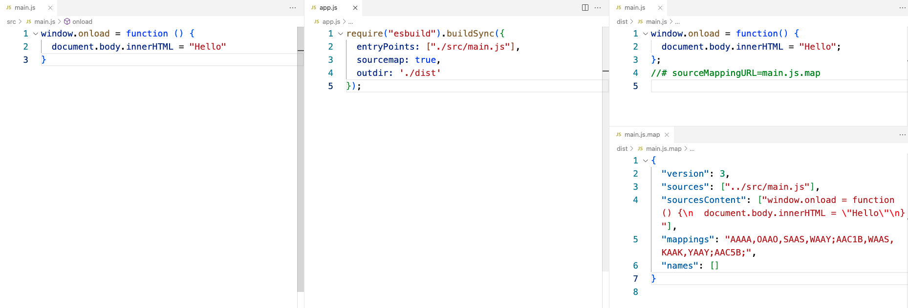

#### external

这种模式与 linked 很相似, 但`.js`文件中不会包含`//# sourceMappingURI=...`标记

```javascript
require("esbuild").buildSync({
  entryPoints: ["app.ts"],
  sourcemap: "external",
  outfile: "out.js",
});
```

结果就像这样:
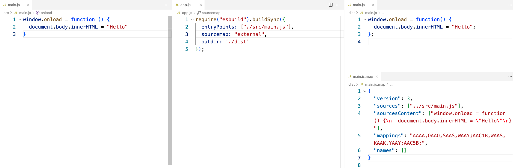

#### inline

这种模式会把 sourcemap 内容添加到`.js`文件的末尾, sourcemap 内容会以 base64 的格式放在`//# sourceMappingURI=`字符之后

```javascript
require("esbuild").buildSync({
  entryPoints: ["app.ts"],
  sourcemap: "inline",
  outfile: "out.js",
});
```

结果就像这样:
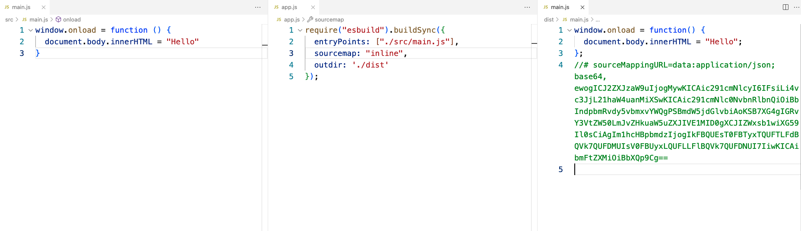

#### both

该模式相当于 line 与 external 二者的结合, 既在`.js`文件中插入了 base64 格式的 sourcemap 内容, 又额外生成了包含 sourcemap 内容的`.map.js`文件

```javascript
require("esbuild").buildSync({
  entryPoints: ["app.ts"],
  sourcemap: "both",
  outfile: "out.js",
});
```

结果就像这样:
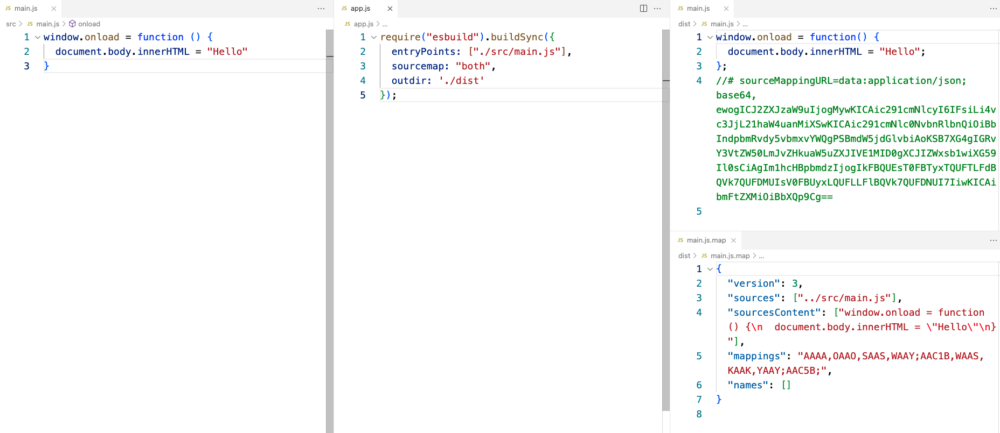

注意, 只有 build API 才支持 sourcemap 选项, tarnsform API 是迟的, 这是因为 transform API 中没有文件名, 此外 CLI 模式下进支持 inline 选项, 因为这个模式下所有的输出都会被写入 stdout 中, 没有输出多个文件这种概念

### SourceRoot

[ build | transform ]

如果你启用了[SourceMap](#sourcemap)功能, 且使用了外部的`.js.map`文件, 该选项用来设定`.js.map`文件内`sourceRoot`属性的值. 像这样:

```shell
esbuild app.js --sourcemap --source-root=https://raw.githubusercontent.com/some/repo/v1.2.3/
```

或者

```javascript
require("esbuild").buildSync({
  entryPoints: ["app.js"],
  sourcemap: true,
  sourceRoot: "https://raw.githubusercontent.com/some/repo/v1.2.3/",
});
```

#### 译者案例:

没有使用该配置的:

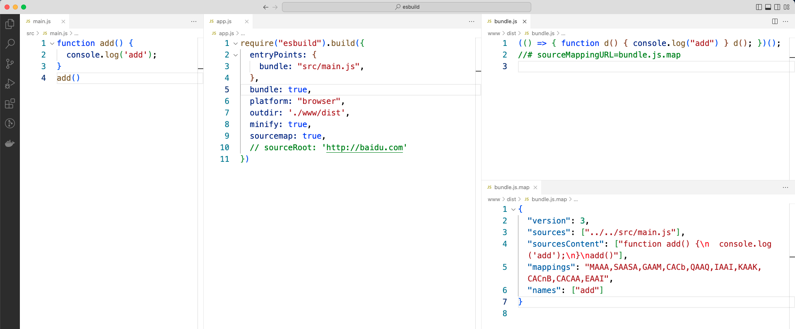

使用了该配置的:

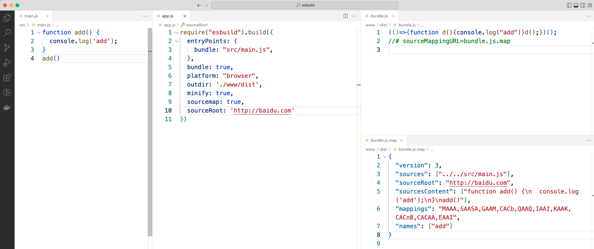

> 译者注: 在测试 sourcemap 功能的案例中,不管有没有该字段,chrome 浏览器,都能正确的找到源代码,不知道这个字段到底有什么影响, 知道具体作用及影响的可以联系我补充一下.

### Sourcefile

[ build | transform ]

当你使用 esbuild 处理一个没有文件名的内容时, `.js.map`文件中的入口文件名默认是`stdin`, 该选项用来修改这个入口文件名.

#### 译者案例

没有配置该选项时:

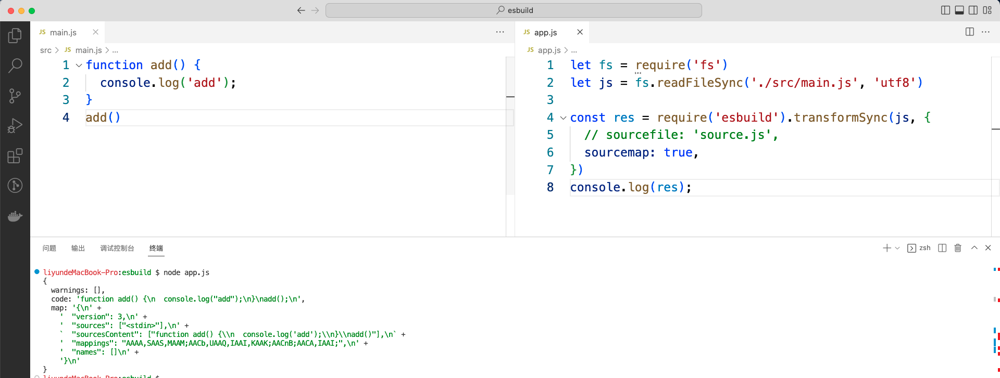

配置了该选项时:

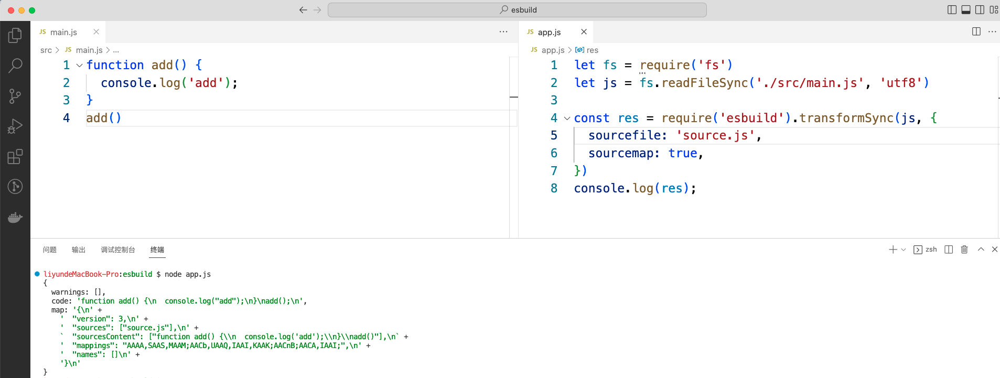

### SourceContent

[ build transform ]

目前 esbuild 生成的 sourcemap 文件, 采用的是[source map format verson 3](https://sourcemaps.info/spec.html)版本. 这个版本是目前应用最广泛的版本. 每个 sourcemap 文件的内容都是类似于这样的:

```json
{
  "version": 3,
  "sources": ["bar.js", "foo.js"],
  "sourcesContent": ["bar()", "foo()\nimport './bar'"],
  "mappings": ";AAAA;;;ACAA;",
  "names": []
}
```

`sourceContent`属性值通常包含了所有的源代码, 这些源代码对项目调试帮助很大.

但是在某些情况下是不需要这些源代码的, 比如构建生产包时, 是不需要这些内容的. 在这种情况下, 完全可以关闭`sourceContent`字段, 来减小`sourcemap`文件的体积, 像这样:

```shell
$ esbuild --bundle app.js --sourcemap --sources-content=false
```

或者

```javascript
require("esbuild").buildSync({
  bundle: true,
  entryPoints: ["app.js"],
  sourcemap: true,
  sourcesContent: false,
  outfile: "out.js",
});
```

### Stdin

[ build ]

[build API](#build-api)一般需要一个或者多个入口文件作为输入文件,

这个选项用于打包非文件类型的代码, 这里非文件类型, 指的是通过管道符传递给 esbuild 的代码, 比如你通过`cat app.js | esbuild `执行的构建任务, 就属于直接把`app.js`的文件内容传递给 esbuild 执行

除了可以指定构建内容之外, 你还可以配置它的解析目录(用于确定导入文件的位置), 在 soucemap 文件中现实的文件名称, 以及处理源代码的解析方式. 像这样:

```javascript
let result = require("esbuild").buildSync({
  stdin: {
    contents: `export * from "./another-file"`,

    // These are all optional:
    resolveDir: require("path").join(__dirname, "src"),
    sourcefile: "imaginary-file.js",
    loader: "ts",
  },
  format: "cjs",
  write: false,
});
```

注意: 命令行模式中无法配置解析目录, 但是它会自动设置当前工作目录作为解析目录.

### Splitting

[ build ]

> 该功能目前正在逐步完善中, 它目前仅适用于构建 esm 格式的输出, 目前该功能已经有一个已知的排序问题. 您可以关注[esbuild issue](https://github.com/evanw/esbuild/issues/16)来获取该问题的最新进展

这个选项主要有两个目的:

1. 把多个入口文件之间共享的代码拆分到一个单独的共享文件中, 如果用户访问第一个入口文件时, 共享部分已经被用户的浏览器下载或者缓存, 访问另一个入口文件时, 就不必重新下载共享代码部分了

2. 把通过`import()`动态异步加载的代码也被拆分到一个单独的文件中, 这可以使您仅在需要时延迟下载这部分代码来缩短应用程序的初始化时间

如果没有启动该功能, `import()`表达式将会被转换成`Promise.resolve().then(()=>require())`, 虽然也保留了异步的意义, 但它也仅仅表明所导入的代码也在当前包的代码中, 并不会指向一个单独的文件

启用该功能时, 必须保证[outdir](#outdir)选项是有值的

```javascript
require("esbuild").buildSync({
  entryPoints: ["home.ts", "about.ts"],
  bundle: true,
  splitting: true,
  outdir: "out",
  format: "esm",
});
```

这里有一个案例:
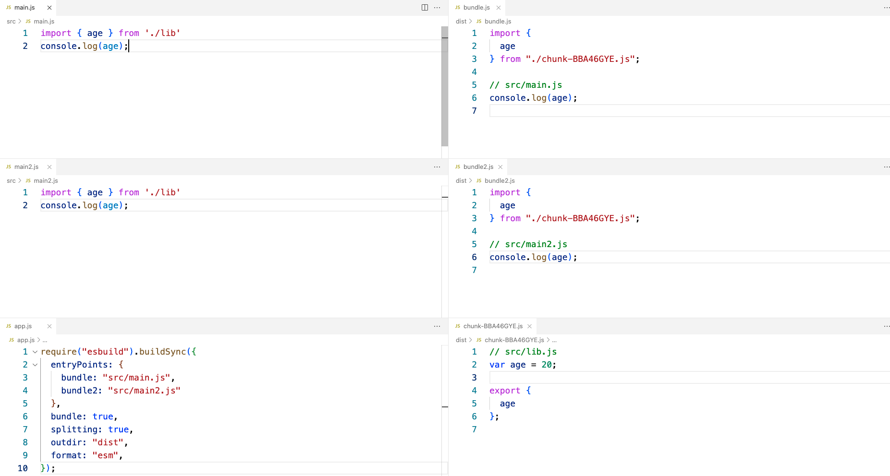

### GlobalNames

这个选项只有在[format](#format)选项配置为`iife`时才有用, 它的作用是设置暴露在全局上下文的模块名称, 用法像这样:

```shell
$ echo 'module.exports = "test"' | esbuild --format=iife --global-name=xyz
```

或者

```javascript
let js = 'module.exports = "test"';
require("esbuild").transformSync(js, {
  format: "iife",
  globalName: "xyz",
});
```

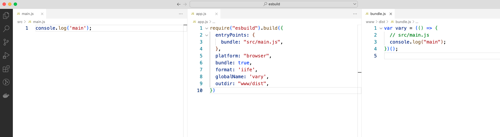

该选项的值还可以设置为一段表达式字符串, 像这样:

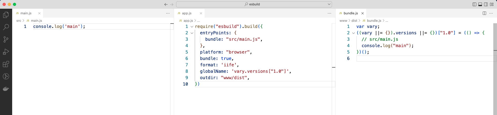

### AssetNames

[ build ]

该选项用来设置静态文件通过 esbuild 构建之后的保存信息, 它的值是一个模板字符串. 比如下面这个案例, 所有的`.png`文件会被保存在`outdir`目录下的`assets`目录, 并且会被重命名为`[name]-[hash]`的格式.

```shell
esbuild app.js --asset-names=assets/[name]-[hash] --loader:.png=file --bundle --outdir=out
```

或者:

```javascript
require("esbuild").buildSync({
  entryPoints: ["app.js"],
  assetNames: "assets/[name]-[hash]",
  loader: { ".png": "file" },
  bundle: true,
  outdir: "out",
});
```

esbuild 提供的额模板字符串包含了下面四种占位符:

- [dir]
  表示源文件在项目内的相对路径, 如果使用了这个占位符, 可以在让文件在`outdir`目录中的路径更为美观, 可以更直接的看到源文件的原有位置
- [name]
  表示不带扩展名的原始文件名, 比如: 如果源文件的名字为`image.png`, 那么占位符`[name]`对应的值就是`image`
- [hash]
  表示文件对应的哈希值, 这个值是很重要的, 可以用来避免命名冲突, 加入你的代码中引入`components/buttonicon.png`与`components/select/icon.png`两个文件, 在这种情况下, 你就必须使用文件的 hash 值来区分它们
- [ext]
  表示文件的原有扩展名, 如果你使用了这个占位符, 它可以很轻松地帮你把不同类型的文件放入不同的目录中, 例如`--assets-name=asssets/[ext]/[name]-[hash]`参数可能会把文件`image.png`保存为`assets/png/image-BF2382F32.png`文件

配置该选项的时候, 不需要指定文件扩展名, 因为 esbuiild 会自动把原有的扩展名添加到输出路径的末尾

这个选项的功能会有点类似于[chunk names]()和[entry names]()选项.

### ChunkNames

[ build ]

这个选项在启用了[Splitting](#splitting)功能时, 用来指定共享部分代码要保存的文件路径与文件名. 它的值也是一个可以使用占位符的模板字符串, 占位符将会被 esbuild 自动替换为特定的值, 比如下面的这个案例, 指定了共享代码块会被保存在`outdir`目录内一个名为`chunks`的目录内:

```shelll
$ esbuild app.js --chunk-names=chunks/[name]-[hash] --bundle --outdir=out --splitting --format=esm
```

或者

```javascript
require("esbuild").buildSync({
  entryPoints: ["app.js"],
  chunkNames: "chunks/[name]-[hash]",
  bundle: true,
  outdir: "out",
  splitting: true,
  format: "esm",
});
```

该选项支持以下三种占位符:

- [name]
  目前这个值代表的是一个固定字符串`chunk`, 在未来的版本中可能会采用其他值
- [hash]
  表示该文件的 hash 值, 在生成多个共享文件时, 使用这个占位符是很重要的
- [ext]
  表示共享文件的扩展名, 它可以帮你把不同类型的共享文件, 分别保存到不同的目录中

`chunknames`的值也不需要手动添加文件扩展名, esbuild 会自动为这些文件添加适当的扩展名.

要注意, 这个选项仅仅用来控制[splitting](#splitting)所生成的文件, 不能控制[entry points](#entry-points)文件的输出格式

### EntryNames

[ build ]

该选项用来控制每个入口文件对应的输出文件名, 它的值也是一个可以包含占位符的模板字符串, 在生成输出路径时, 占位符会被替换为特定的字符串, 像下面的案例, 入口文件的最终保存路径可能像这样:`dist/app-9F3J8F.js`:

```shell
esbuild src/main-app/app.js --entry-names=[dir]/[name]-[hash] --outbase=src --bundle --outdir=out
```

或者

```javascript
require("esbuild").buildSync({
  entryPoints: ["src/main-app/app.js"],
  entryNames: "[dir]/[name]-[hash]",
  outbase: "src",
  bundle: true,
  outdir: "out",
});
```

模板字符串中可以包含以下四种占位符:

- [dir]
  表示入口文件相对于`outbase`目录的相对路径, 它的作用是可以帮助你避免不同子目录中,同名文件之间的冲突, 比如你的`outbase`目录为`src`, 有两个文件`src/pages/about/index.ts`和`src/pages/home/index.ts`, 假设你设置了`--entry-names=[dir]/[name]`, 那么这两个入口文件的最终输出目录会变成`pages/home.js`与`pages/about.js`
- [name]
  表示没有扩展名的文件名, 例如如果入口文件为`app.js`, 那么该占位符表示的值就是`app`
- [hash]
  表示输出文件的内容 hash 值, 将 hash 值添加到入口文件名称中,意味着 esbuild 将会计算该入口文件内包含的所有内容的 hash 值, 这个值只有在文件内容发生变化时,才会更改. 这有利于充分利用浏览器的缓存功能

  同时, 你还可以利用[metafile](#metafile)中的信息, 来确定哪个入口文件对应的哪个输出文件,以此来确保在你的项目中用`script`标签引入正确的文件

- [ext]
  表示文件的扩展名, 它可以用来把不同类型的文件保存到不同的目录中

该选项的值中也不需要添加任何的文件扩展名, esbuild 会自动添加合适的扩展名到输出路径中

这个选项也有点类似于[assets names](#assetnames)和[chunk names](#chunknames), 一定不能混淆了

### OutExtension

这个选项可以让你自定义 esbuild 生成的文件的扩展名, `.mjs`与`.cjs`在 Node 分别表示`ESM模块`与`ComonJS模块`. 如果你的项目生成了多个文件, 可以像这样使用:

```shell
$ esbuild app.js --bundle --outdir=dist --out-extension:.js=.mjs
```

或者

```javascript
require("esbuild").buildSync({
  entryPoints: ["app.js"],
  bundle: true,
  outdir: "dist",
  outExtension: { ".js": ".mjs" },
});
```

### Serve

[ build ]

在开发过程中, 如果代码发生了改动, 在浏览器中重新加载代码可能需要重新运行 esbuild 命令, 这是很不方便的, 有几种方法可以自动执行此类操作:

1. 使用[Watch](#watch)选项, 以监视模式重新运行 esbuild
2. 把编辑器配置为当文件发生改变时, 自动重新运行 esbuild
3. 通过配置一个 Web 服务器, 在每次发生请求时, 自动重新运行 esbuild

Server 选项采用了上述的第三种方式. 它类似于执行`build`API, 但不同的是, 它不会把打包后的文件保存在文件系统, 而是会启动一个 web 服务, 打包后的文件会被保存在 web 服务器内, 每次新的请求, 都会导致 esbuild 在响应请求之前重新运行构建命令, 以此来保证每次你的请求始终是最新的

这种方式的优点是在最新构建完成之前, 浏览器不会运行之前构建的代码, 这些代码将直接从内存中获取, 提高了运行速度的同时, 还可以确保 web 服务器不会使用旧的构建文件.

请注意, 这个选项仅用于开发, 不要在生产环境中使用它, 在生产环境中, 您不应该使用 esbuild 来提供 Web 服务

一般来说有有两种不同的方式来使用这个 API:

#### 通过 esbuild 启动一个通用的服务器

这种模式下, 你需要传递一个`servedir`选项, 来设置服务器的根目录, 在这个目录中, 除了最终的构建文件之外,还可以提供其他类型文件的访问, 比如有一个`/www/index.html`文件, 再把 esbuild 的`outdir`设置为`/www/js/`, 像这样:

```html
<!-- index.html -->
<script src="/js/bundle.js"></script>
```

```javascript
// main.js
window.onload = function () {
  document.body.innerHTML = "Hello";
};

// app.js
require("esbuild")
  .serve(
    {
      servedir: "www",
      port: "8000",
    },
    {
      entryPoints: ["src/app.js"],
      outdir: "www/js",
      bundle: true,
    }
  )
  .then((server) => {
    // Call "stop" on the web server to stop serving
    server.stop();
  });
```

现在, 你可以通过`http://localhost:8000`访问到`/www/index.html`的内容, 并且可以在浏览器中看到`Hello`字符

当你使用这种方式时, 每个 http 请求都会导致 esbuild 重新构建你的代码来提供新的版本, 所以每次刷新页面时, `bundle.js`都会是最新的版本.

如果你此时看一下`www/js`目录, 你会发现`bundle.js`并没有被保存在这个目录中, 而是直接被 esbuild 提供的服务器直接从内存中获取

需要注意的是, 你的 html 文件中引用`bundle.js`的路径在开发和生产模式下是可以完全一致的, 在生产模式下, 即便是你省略了`servedir`选项, esbuild 会将改文件写入文件系统中的相同路径中

默认情况下, esbuild 会选择一个大于或者等于 8000 的开放端口, 在`then`函数中你可以获取到 esbuild 实际的绑定端口地址, 如果需要你也可以手动指定要绑定的端口号

#### 通过 esbuild 启动一个只允许请求打包文件的服务器

在不提供`serverdir`选项的模式下, esbuild 启动的服务器仅支持对打包文件的访问, 这种模式适用于更加复杂的应用场景, 比如某些情况下, 你希望使用 nginx 对某些文件进行不同的反向代理. 此时 esbuild 将会以`ourdir`作为服务器的根目录, 就像这样:

```javascript
require("esbuild")
  .serve(
    {
      port: 8000,
    },
    {
      entryPoints: ["src/app.js"],
      bundle: true,
      outfile: "out.js",
    }
  )
  .then((server) => {
    // Call "stop" on the web server to stop serving
    server.stop();
  });
```

现在, 你只能通过`http://localhost:8000/bundle.js`访问到`bundle.js`文件, 而你的`www/index.html`文件是不能通过这个地址访问的, 如果想访问到该文件, 必须通过另一个 web 服务器. 和第一种方式一样, 每次请求都会导致一次重新构建

通过访问`http://localhost:8000/`你可以访问到服务器的根目录, 在这里你可以看到所有的构建文件, 通过点击文件链接可以浏览文件的具体内容

#### 参数

请注意, Serve API 与 BuildAPI 是同级别的 API, Serve API 的第一个参数是用来配置服务器参数的的对象, 第二个参数与 Build API 的参数是相同的

```Typescript
interface ServeOptions {
  port?: number;
  host?: string;
  servedir?: string;
  onRequest?: (args: ServeOnRequestArgs) => void;
}

interface ServeOnRequestArgs {
  remoteAddress: string;
  method: string;
  path: string;
  status: number;
  timeInMS: number;
}
```

##### port

用来设置 http 服务器绑定的端口号, 如果没有配置, 它会自动优先使用 8000 作为访问端口, 命令行中你可以使用`--serve=8000`的方式来指定端口号

##### host

默认情况下, esbuild 提供的 http 服务器绑定的 host 地址是`0.0.0.0`, 这意味着你可以通过服务所在电脑的任意一张网卡访问到 http 服务, 你也可以设置一个特地的值,来限制某些特殊的访问, 比如你可以设置`--serve=127.0.0.1:8000` 来限制只允许来自本机的访问

如果你使用的是 IPv6, 就需要制定一个 IPv6 的地址, 比如用`::`来代表`0.0.0.0`, 或者用`::1`来代表`127.0.0.1` 如果是在命令行上指定该参数, 需要使用方括号把地 host 地址包裹起来, 像这样`--serve=[::]:8000`或者`--serve=[::1]:8000`

##### servedir

这个参数用来指定 http 服务器的根目录, 如果使用命令行, 可以通过`--servedir=dir`的方式设置该参数

##### onRequest

每次请求时, 该参数对应的函数就会被调用一次, 并且会提供当前请求的一些信息, 需要注意的是, 这个调用是在请求完成后执行的, 你无法使用这个参数以任何方式修改请求, 如果你想实现这种目的, 需要在 esbuild 请求前添加一个额外的代理.

#### 返回值

Servce API 返回的是一个 Promise 对象, 包含以下内容:

```Typescript
interface ServeResult {
  port: number;
  host: string;
  wait: Promise<void>;
  stop: () => void;
}
```

##### port

表示当前 http 服务最终使用的端口号, 当你没有手动指定端口号时, 可以通过这里查看最终使用的端口号, 如果你使用了命令行, 端口号信息会打印在 stdout 上

##### host

表示当前 http 服务最终使用的 host 地址, 没有手动指定 host 的时候, 它的值是`0.0.0.0`

##### wait

wait 的值是一个 Promise 对象, 严格来说, 当提供的 http 服务由于某些原因导致被终止, 该 Promise 会被标记为 reject. 在这里你可以获取引起终止的具体情况

##### stop

stop 用来手动终止 esbuild 提供的 http 服务, 调用 stop 时, 会立即终止所有打开的连接, 且唤醒 wait 属性中处理的事件

### 自定义服务器行为

用户无法自定义 esbuild 服务器的行为, 如果需要, 你可以自行在 esbuild 前面设置一个代理服务器来自定义某些行为.

比如下面这案例中, 就添加了一个自定义的 404 页面, 用来替换 esbuild 本身提供的 404 页面:

```javascript
const esbuild = require("esbuild");
const http = require("http");

// 通过esbuid启动一个服务
esbuild
  .serve(
    {
      servedir: __dirname,
    },
    {
      // ... your build options go here ...
    }
  )
  .then((result) => {
    // 获取esbuild服务使用的host与port
    const { host, port } = result;

    // 启动一个代理服务器, 监听端口3000
    http
      .createServer((req, res) => {
        const options = {
          hostname: host,
          port: port,
          path: req.url,
          method: req.method,
          headers: req.headers,
        };

        // 使用Nodejs内置的http模块发起请求
        const proxyReq = http.request(options, (proxyRes) => {
          // 如果esbuild返回404状态码, 返回自定义的404页面
          if (proxyRes.statusCode === 404) {
            res.writeHead(404, { "Content-Type": "text/html" });
            res.end("<h1>A custom 404 page</h1>");
            return;
          }

          // 否则, 把esbuild返回的内容原封不动的返回会给客户端
          res.writeHead(proxyRes.statusCode, proxyRes.headers);
          proxyRes.pipe(res, { end: true });
        });

        // 把访问3000的请求转发到esbuild的http服务上
        req.pipe(proxyReq, { end: true });
      })
      .listen(3000);
  });
```

这个案例最主要的功能是替换了 esbuild 服务出现 404 状态时的返回内容, 除此之外, 你还可以做很多事情, 比如在 esbuild 处理请求之前修改请求的参数, 或者修改 esbuild 返回的内容, 比如:

- 注入自己的 404 页面(就是上面这个例子)
- 自定义一个文件系统路由
- 将某些访问重定向到 esbuild 之外的其他 http 服务器
- 使用自己的签名证书以提供 https 支持等

需要的话你也可以使用 nginx 做一个反向代理来完成更多高级的功能

### Watch

[ build ]

该选项可以开启监控模式, 用来告诉 esbuild 如果有相关文件发生改动, 就自动重新构建一次, 用法像这样:

```javascript
require("esbuild")
  .build({
    entryPoints: ["app.js"],
    outfile: "out.js",
    bundle: true,
    watch: true,
  })
  .then((result) => {
    console.log("watching...");
  });
```

或者

```shell
esbuild app.js --outfile=out.js --bundle --watch
```

如果你使用 JavaScript 或者 Go 的 API 来调用 esbuild, 可以在 watch 选项中添加一个执行结果回调函数, 每次构建完成后, 都会调用这个回调函数, 这可以方便用户在构建完成后自定义一些其他的操作, 比如让你的浏览器重新加载应用程序等.

```javascript
require("esbuild")
  .build({
    entryPoints: ["app.js"],
    outfile: "out.js",
    bundle: true,
    watch: {
      onRebuild(error, result) {
        if (error) console.error("watch build failed:", error);
        else console.log("watch build succeeded:", result);
      },
    },
  })
  .then((result) => {
    console.log("watching...");
  });
```

你也可以选择在某些需要的情况下停止监控模式, 像这样:

```javascript
require("esbuild")
  .build({
    entryPoints: ["app.js"],
    outfile: "out.js",
    bundle: true,
    watch: true,
  })
  .then((result) => {
    console.log("watching...");

    setTimeout(() => {
      result.stop();
      console.log("stopped watching");
    }, 10 * 1000);
  });
```

监控模式用的是轮询的模式, 而非传统的通过操作系统的 APi 实现的, 使用轮询的目的是希望尽可能的减少 CPU 的占用, 这种方式会稍晚一些知道文件内容发生改变.

你也可以利用[incremental build api](#incremental)来实现自定义的监控模式.

如果您使用的是命令行模式, 关闭 esbuild 的时候监控模式将自动停止,这是为了防止 esbuild 继续消耗系统资源, 如果你希望 esuild 持续此行为, 可以使用`--watch=forever`而不仅仅是`--watch`

### Write

[ build ]

该选项用来设置是否把构建后的文件写入文件系统, 默认情况下, ClI 和 JavaScript API 的方式会写入文件系统, Go API 不会写入文件系统, 会写入内存缓存区. 你可以手动启用写入文件系统的功能.

```javascript
let result = require("esbuild").buildSync({
  entryPoints: ["app.js"],
  sourcemap: "external",
  write: false,
  outdir: "out",
});

for (let out of result.outputFiles) {
  console.log(out.path, out.contents);
}
```

### AllowOverwrite

[ build | transform ]

该选项允许使用最终的构建文件覆盖源文件, 默认情况下不会启用这个参数, 因为这样做意味着如果你没有保存源代码, 可能会导致源代码丢失, 如果你的项目希望最终文件覆盖源代码, 可以像这样使用他:

```javascript
require("esbuild").buildSync({
  entryPoints: ["app.js"],
  outdir: ".",
  allowOverwrite: true,
});
```

或者

```shell
esbuild app.js --outdir=. --allow-overwrite
```

### Analyze

[ build ]

启用这个选项将会在构建结束后生成一个详细的报告, 用法像这样:

```javascript
(async () => {
  let esbuild = require("esbuild");

  let result = await esbuild.build({
    entryPoints: ["example.jsx"],
    outfile: "out.js",
    minify: true,
    metafile: true,
  });

  let text = await esbuild.analyzeMetafile(result.metafile);
  console.log(text);
})();
```

或者在命令行中执行:

```shell
$ esbuild --bundle example.jsx --outfile=out.js --minify --analyze
...

  out.js                                                                    27.4kb  100.0%
   ├ node_modules/react-dom/cjs/react-dom-server.browser.production.min.js  19.2kb   70.2%
   ├ node_modules/react/cjs/react.production.min.js                          5.9kb   21.5%
   ├ node_modules/object-assign/index.js                                     962b     3.4%
   ├ example.jsx                                                             137b     0.5%
   ├ node_modules/react-dom/server.browser.js                                 50b     0.2%
   └ node_modules/react/index.js                                              50b     0.2%
```

输出的信息中显示了哪些文件被打包最终文件内, 且它们在最终文件内各自的占比. 如果你想了解更多详细信息, 可以开启`verbose`模式, 该模式将显示更为详细的跟踪信息, 就像这样:

```javascript
(async () => {
  let esbuild = require("esbuild");

  let result = await esbuild.build({
    entryPoints: ["example.jsx"],
    outfile: "out.js",
    minify: true,
    metafile: true,
  });

  let text = await esbuild.analyzeMetafile(result.metafile, {
    verbose: true,
  });
  console.log(text);
})();
```

或者在命令行中像这样使用:

```shell
$esbuild --bundle example.jsx --outfile=out.js --minify --analyze=verbose
...

  out.js ─────────────────────────────────────────────────────────────────── 27.4kb ─ 100.0%
   ├ node_modules/react-dom/cjs/react-dom-server.browser.production.min.js ─ 19.2kb ── 70.2%
   │  └ node_modules/react-dom/server.browser.js
   │     └ example.jsx
   ├ node_modules/react/cjs/react.production.min.js ───────────────────────── 5.9kb ── 21.5%
   │  └ node_modules/react/index.js
   │     └ example.jsx
   ├ node_modules/object-assign/index.js ──────────────────────────────────── 962b ──── 3.4%
   │  └ node_modules/react-dom/cjs/react-dom-server.browser.production.min.js
   │     └ node_modules/react-dom/server.browser.js
   │        └ example.jsx
   ├ example.jsx ──────────────────────────────────────────────────────────── 137b ──── 0.5%
   ├ node_modules/react-dom/server.browser.js ──────────────────────────────── 50b ──── 0.2%
   │  └ example.jsx
   └ node_modules/react/index.js ───────────────────────────────────────────── 50b ──── 0.2%
      └ example.jsx
```

这份分析数据可以在[metafile](#metafile)选项对应的文件中找到这份数据, 如果这份可视化数据不能完全满足你的需要, 你完全可以使用 metafile 提供的 JSON 数据加上其他的可视化数据分析工具构建自己的可视化效果

请注意这份数据的格式是为了方便人们更容易的阅读, 数据的格式可能会随着时间发生变化, 这可能会影响使用该数据的解析结果.

### Banner

[ build ]

该选项可以配置在 js 文件或者 css 文件的开头插入内容, 一般会用来插入注释型字符, 就像这样:

```shell
esbuild app.js --banner:js=//comment --banner:css=/*comment*/
```

或者:

```javascript
require("esbuild").buildSync({
  entryPoints: ["app.js"],
  banner: {
    js: "//comment",
    css: "/*comment*/",
  },
  outfile: "out.js",
});
```

请注意, 如果你一定要在 CSS 文件的开头插入非注释型字符, 由于 CSS 会忽略所有不在开头的`@import()`语句, 可能导致你的某些样式丢失.(这句话我没找到合适的案例)

### Footer

[ build | transform ]

这个选项用来在 JS 或者 CSS 文件结尾插入指定的字符, 它的功能有点类似于[Banner](#banner), 用法是这样的:

```shell
$ esbuild app.js --footer:js=//comment --footer:css=/*comment*/
```

或者

```javascript
require("esbuild").buildSync({
  entryPoints: ["app.js"],
  footer: {
    js: "//comment",
    css: "/*comment*/",
  },
  outfile: "out.js",
});
```

### Charset

[ build | transform ]

默认情况下, esbuild 只以 ASCII 格式输出文件内容, 任何非 ASCII 字符都会使用反斜杠进行转义. 这是因为非 ASCII 字符在浏览器中可能会被解析错误, 除非你将`<meta charset=utf8>`显式的添加到你的 html 文件中. 另一个原因是非 ASCII 字符会明显降低浏览器的解析速度.

非 ASCII 字符确实会影响输出文件的大小, 也更难以阅读, 如果你希望 esbuild 在构建过程中使用原始字符,而不是转义序列字符, 可以通过该选项来禁用字符转义, 像这样:

```shell
$ echo 'let π = Math.PI' | esbuild
# let \u03C0 = Math.PI;
$ echo 'let π = Math.PI' | esbuild --charset=utf8
# let π = Math.PI;
```

或者:

```javascript
let js = "let π = Math.PI";
// require('esbuild').transformSync(js)
// {
//   code: 'let \\u03C0 = Math.PI;\n',
//   map: '',
//   warnings: []
// }
require("esbuild").transformSync(js, {
  charset: "utf8",
});
// {
//   code: 'let π = Math.PI;\n',
//   map: '',
//   warnings: []
// }
```

注意:

- 此功能不会影响正则表达式中的非 ASCII 字符, 这是因为 esbuild 根本不会解析正则表大会的内容.
- 此功能不会影响注释内容, 因为坐着认为在注释中保留一些非 ASCII 数据是没有问题的, 即时因为编码错误的问题, 也不影响项目的正常运行
- 此功能同时适用于所有的文件类型, 因此如果你设置了当前选项为`utf8`, 请确保你的网络服务器使用了正确的`Content-Type`

### Color

[ build | transform ]

此选项用来控制 esbuild 发生错误或者警告时是否显示带颜色的文字. 默认情况下, 只有当在命令行中输出错误或者警告信息时, 该选项会被自动启用, 否则会自动禁用. 带颜色的内容输出像下面这样:

```shell
▲ [WARNING] The "typeof" operator will never evaluate to "null" [impossible-typeof]

    example.js:2:16:
      2 │ log(typeof x == "null")
        ╵                 ~~~~~~

  The expression "typeof x" actually evaluates to "object" in JavaScript, not "null". You need to
  use "x === null" to test for null.

✘ [ERROR] Could not resolve "logger"

    example.js:1:16:
      1 │ import log from "logger"
        ╵                 ~~~~~~~~

  You can mark the path "logger" as external to exclude it from the bundle, which will remove this
  error.
```

如果你指定该选项的值为`true`则会强制启用彩色输出, 这在你使用 stderr 输出时是非常有用的.

### Conditions

[ build ]

> 注意, 本小节如果只看原文是很难理解的, 所以这里尽可能在原文翻译的基础上添加了译者自己的解读

这个选项用来控制在引入文件时, 根据`package.json`文件中`exports`字段的映射, 与引入文件的方式, 要求 esbuild 重定向到不同的文件

#### 它是怎么工作的

例如下面的案例, 如果你使用了`import('./foo')`, 最终将会导入`./imported.mjs`文件, 如果你使用了`require('./foo')`, 最终将会导入`./required.cjs`文件. 比如下面这个案例:

```json
{
  "name": "pkg",
  "exports": {
    "./foo": {
      "import": "./imported.mjs",
      "require": "./required.cjs",
      "default": "./fallback.js"
    }
  }
}
```

esbuild 会根据 Conditions 值的顺序, 在`exports`字段中查找对应的文件, 它的查找逻辑有点类似于这样:

```javascript
// 译者注: 这部分代码与原文不同, 按原文的理解是错误的, 这是译者自己实践后的结果, 下文中有译者的案例
if( 引入方式 === import ){
    if( exports中有指定import字段 ) return "./imported.mjs"
    if( conditions中有自定义条件 && 模块中有该条件对应的路径) return 自定义条件对应的文件路径
    return 'fallback.js'
}
if( 引入方式 === require ){
    if( exports中有指定require字段 ) return "./required.mjs"
    if( conditions中有自定义条件 && 模块中有该条件对应的路径) return 自定义条件对应的文件路径
    return 'fallback.js'
}
```

默认情况下, esuild 在 Conditions 的值中包含以下五种特定条件, 且这五种条件是不能被禁用的

- default
  这个条件是永远有效的, 如果在`exports`字段中未找到 esbuild 内置的条件或者是自定义条件的映射路径, 则会使用这个字段的路径
- import
  只有当源代码中使用`import`导入文件时, 才会使用这个字段对应的路径
- require
  只有当源代码中使用`require`导入文件或模块时, 才会使用这个字段对应的路径
- browser
  当[platform](#platform)被设置为`browser`时, 会自动使用这个字段对应的路径
- node
  当[platform](#platform)被设置为`node`时,会自动使用这个字段对应的路径

内置条件与自定义条件的优先级如下解释:

1. 先根据引入条件判断`exports`中是否有`import`和`require`的映射路径, 如果有, 优先采用
2. 判断有没有`conditions`中指定的条件, 如果有, 优先采用
3. 判断[platform](#platform)的值, 如果是`browser`, 采用`browser`对应的路径, 如果是`node`, 采用`node`对应的路径
4. 最后采用`exports`中`default`对应的路径

#### 译者提供的案例

这里以`import`方式引入文件为例, 注意观察`bundle.js`文件中最终引入的文件路径:
;
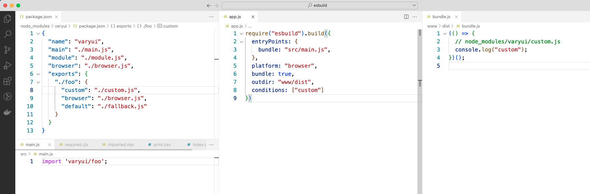;
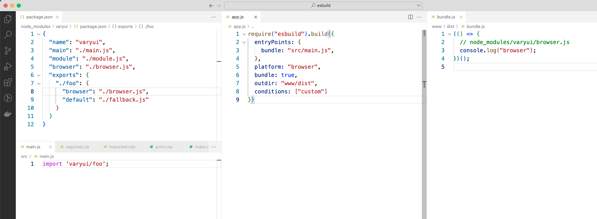;
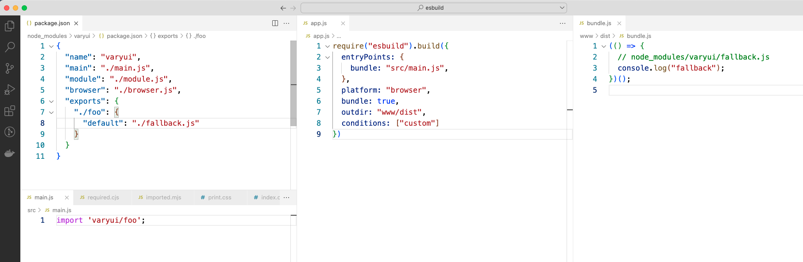;

### Drop

[ build | trasform ]

该选项用来告诉 esbuild 在编译前移除源代码中的某些代码, 目前有两种内容是可以通过这个选项被丢弃的

#### debugger

如果该选项包含了`debugger`值, 会从源代码中删除所有的`debugger`语句; 这个功能就类似于`terser`与`uglifyJS`中的`drop_debuger:true`选项

让你打开调试器时, 执行到`debugger`语句时会自动暂停, 如果没有打开调试器, 这条语句将不执行任何操作. 因此删除`debugger`语句只会影响你的调试功能.

用法是像这样的:

```shell
$ esbuild app.js --drop:debugger
```

或者:

```javascript
require("esbuild").buildSync({
  entryPoints: ["app.js"],
  drop: ["debugger"],
});
```

#### console

如果该选项包含了`console`值, 会从源代码中删除所有与之相关的函数调用, 这个功能类似于`terser`与`uglifyJS`中的`drop_console:true`选项

WARNING: Using this flag can introduce bugs into your code! This flag removes the entire call expression including all call arguments. If any of those arguments had important side effects, using this flag will change the behavior of your code. Be very careful when using this flag.

If you want to remove console API calls without removing the arguments with side effects (so you do not introduce bugs), you should mark the relevant API calls as pure instead. For example, you can mark console.log as pure using --pure:console.log. This will cause these API calls to be removed safely when minification is enabled.

(上面这两段话译者没找到作者想说的案例, 暂不翻译)

移除`console`语句的配置像这样:

```shell
esbuild app.js --drop:console
```

或者

```javascript
require("esbuild").buildSync({
  entryPoints: ["app.js"],
  drop: ["console"],
});
```

#### 译者案例

这里引入一个概念`/* @__PURE__ */`, 如果某条语句前方有这个注释, esbuild 在编译过程中,如果感觉这条语句没有被"真正"地使用过, 会自动删除这条语句, 这种情况下都不需要使用 Drop 选项, 看案例:

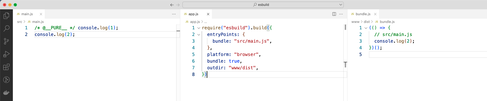

### IgnoreAnnotations

[ build | transform ]

由于 JavaScript 是一种动态语言, 所以对于编译器来说,很难识别哪些代码是未被使用的. 因此社区指定了一些规范来帮助编译器是被哪些代码是"无副作用的",且"可以被安全删除的". 目前 esbuild 支持两种形式的注释:

- 在语句前添加`/* @__PURE__ */`注释, 告诉 esbuild, 如果这条语句的返回值没有被其他代码使用, 就可以删掉改语句, 详细的可以查看[pure](#pure)选项
- `package.json`中的`sideEffects`字段一般用来告诉编译工具, 包里哪些文件是无副作用的. 如果`sideEffects`的值为`false`, 则表示整个包都是无副作用的, 如果该包仅仅导入进你的项目, 却没有以任何形式使用, 则可以在构建过程中安全删除整个包的内容. 这是打包工具`webpack`内部规定的, 目前已经有许多 npm 包的`package.json`文件中包含了这个字段, 所以你可以在 webpack 的[相关文档](https://webpack.js.org/guides/tree-shaking/#mark-the-file-as-side-effect-free)了解到更详细的信息.

使用注释是很容易出现问题的, 因为编译结果是否准确完全取决于开发人员是否使用了正确的注释. 默认情况下, 如果引入一个包(模块), 却没有使用它提供的内容, 那么该包整体会被忽略,删除. 在这种情况下, 如果你添加了一个带有副作用的新文件, 却忘记更新`sideEffects`字段, 可能导致引用该包的项目出现问题.

所以 esbuild 提供了`ignoerAnnotations`选项, 用来忽略`/* @__PURE__ */`注释的作用. 用法如下:

```shell
$ esbuild app.js --bundle --ignore-annotations
```

或者:

```javascript
require("esbuild").buildSync({
  entryPoints: ["app.js"],
  bundle: true,
  ignoreAnnotations: true,
  outfile: "out.js",
});
```

译者这里提供一个案例, 可以与[Drop](#drop)部分的案例做一个对比:

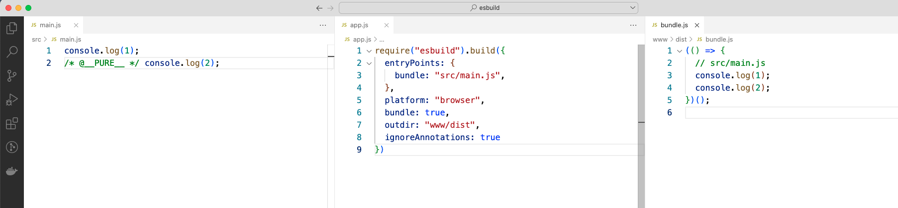

因此, 启用这个选项以为这 esbuild 将不再处理`/* @__PURE__ */`注释, 但是 esbuild 仍然会对未使用的模块进行 tree shaking, 因为这个功能不依赖于开发人员的注释.

### Pure

[ build | transform ]

> 译者注: 本节原文内容太难理解, 因此译者在原文的基础上修改, 内容比原文只多不少

默认情况下, 如果一个语句前添加了`/* @__PURE__ */` 或者 `/* #__PURE__ */`, 那么当该语句的返回值没有被使用时, esbbuild 会自动删除这条语句, 就像这样(译者案例):

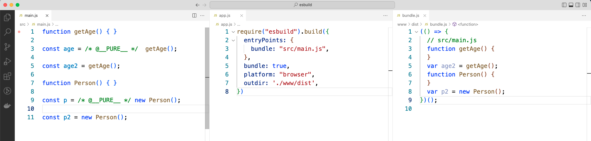

这个案例中,`const age = /* @__PURE__ */ add();`被 esbuild 删除了, 是因为`add()`的返回值`age`是未被使用的变量. `function add(){}`被删除了, 是因为 esbuild 在 tree-shaking 过程中发现该函数是未被使用的函数. `const p = /* @__PURE__ */ new Person();`被删除的原因是一样的. 但是`const age2 = getAge();`与`var p2 = new Person();`被保留了下来.

请注意, 虽然这行注释中有`PURE`字符, 它的意义并不是表示后面的是一个"纯函数", 而是表示"如果这条语句的返回值如果没有被使用则可以被删除".

一些 javascript 语句会在构建的过程中自动被 esbuild 标记为`/* @__PURE__ */`, 比如 JSX 表达式(译者案例):

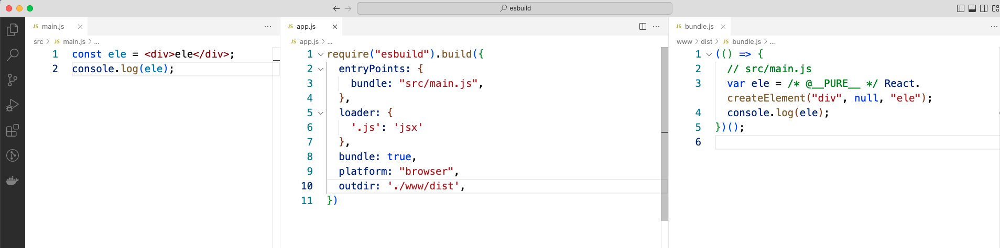

但是, 使用`/* @__PURE__ */` 或者 `/* #__PURE__ */`标记的语句, 如果内部包含其他函数调用, 将不会被 esbuild 删除, 比如这个(译者案例):

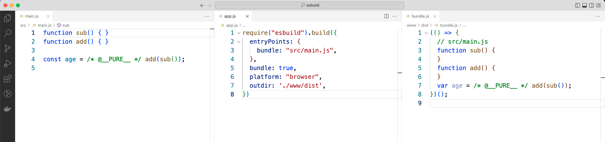

这个案例中, 因为`add()`调用的时候, 它的参数使用了`sub()`函数的返回值, esbuild 并不能确定`sub()`函数有没有其他副作用, 所以不会删除这条语句.

`Pure`选项功能就类似于在语句前添加`/* @__PURE__ */` 或者 `/* #__PURE__ */`标记, 它用来告诉 esbuild, 如果某些"Javascript 内置 API"的返回值未被使用, 则删除这些语句.比如(译者案例):

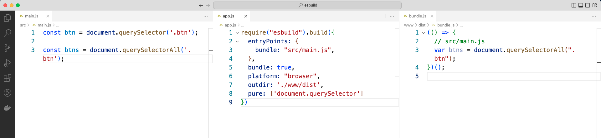

### Metafile

该选项用来告诉 esbuild, 让它在编译结束后提供一份 JSON 格式的分析报告, 下面的案例中把 esbuild 提供的构建分析报告保存在一个文件中:

```javascript
const result = require("esbuild").buildSync({
  entryPoints: ["app.js"],
  bundle: true,
  metafile: true,
  outfile: "out.js",
});
require("fs").writeFileSync("meta.json", JSON.stringify(result.metafile));
```

命令行是这样写的:

```shell
$ esbuild app.js --bundle --metafile=meta.json --outfile=out.js
```

然后你就可以使用其他的可视化工具分析这份数据, 比如[bundle buddy](https://www.bundle-buddy.com/esbuild)

这份 JSON 数据中包含以下数据:

```javascript
interface Metadata {
  inputs: {
    [path: string]: {
      bytes: number
      imports: {
        path: string
        kind: string
      }[]
    }
  }
  outputs: {
    [path: string]: {
      bytes: number
      inputs: {
        [path: string]: {
          bytesInOutput: number
        }
      }
      imports: {
        path: string
        kind: string
      }[]
      exports: string[]
      entryPoint?: string
      cssBundle?: string
    }
  }
}
```

### Incremental

[ build ]

如果在项目中你需要使用相同的配置多次调用 build API, 就可以启用该选项. 比如你正在实现一个文件监听服务, 这个选项将会很有用. 因为增量编译模式下, 一些数据或被缓存, 如果原始文件没有更改, 这些缓存数据会被重复使用, 而不是重复构建. 这种增量更新目前有两种形式的缓存:

1. 如果文件系统中的文件自最后一次构建之后,没有新的改动, 它的数据会缓存在内存中, 下次构建将直接从内存中获取数据, 而不是从文件系统中读取, 这种模式只适用于文件系统中的文件, 通过其他插件生成的虚拟模块无法通过这种方式进行缓存.

2. 通过其他插件生成的虚拟模块也会被缓存到内存中, 如果虚拟模块自上次构建之后没有更新, 也会直接从内存中读取. 这种模式只适用于通过其他插件等方式生成的虚拟模块或文件.

这里有一个如何使用增量构建的案例:

```javascript
async function example() {
  let result = await require("esbuild").build({
    entryPoints: ["app.js"],
    bundle: true,
    outfile: "out.js",
    incremental: true,
  });

  // Call "rebuild" as many times as you want
  for (let i = 0; i < 5; i++) {
    let result2 = await result.rebuild();
  }

  // Call "dispose" when you're done to free up resources.
  result.rebuild.dispose();
}

example();
```

### Supportted

[ build ]

这个选项允许你自定义 esbuild 对语法转换的规则, 比如, 你可以告诉 esbuild 目标环境不支持`bigint`, 当 esbuild 发现你在源代码中用了它, 会抛出错误. 通常这个选项会配合[Traget](#target)选项来使用. 无论[Traget](#target)选项中指定了什么值, 都会被该选项覆盖

这里有几个你可能需要使用该选项的案例:

1. javascript runtime 在使用某些新的语法特性时, 可能会比旧语法特性速度慢很多 , 你可以模拟告诉 esbuild 不支持某个语法特性, 来让打包文件获得更快的执行速度. 比如 V8 引擎中有一个[long-standing performance bug regarding object spread](https://bugs.chromium.org/p/v8/issues/detail?id=11536)的已知问题(大体上是说`新的扩展运算符在进行属性合并时比Object.assign()实现的速度慢了很多`). 现在如果你在`target`属性中包含了基于 V8 引擎的运行环境时, 可以告诉 esbuild, 目标环境不支持扩展运算符这个语法, esbuild 将会采用硬编码的方式来优化这个问题, 就像这样:

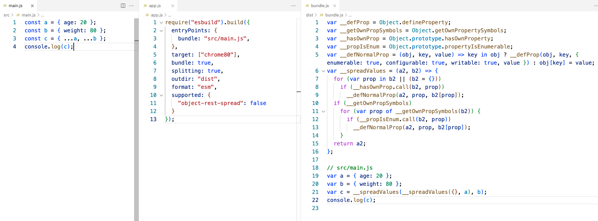

从图中可以看出来, 源码中的扩展运算符, 经过 esbuild 编译后, 被一个`__spreadValues`函数替换了

2. 还有其他很多的语法特性在目标环境中是没有被实现的(暂时不被支持的), 如果你出现了此类问题, 也可以使用当前选项告诉 esbuild, 让 esbuild 来解决这些问题. 比如 Typescript 的解析器可能不支持[arbitrary module namespace identifier names s](https://github.com/microsoft/TypeScript/issues/40594)(包含任意字符的模块命名), 你就需要告诉 esbuild 目标环境不支持该语法.

3. 你可能正在使用另一个工具再次处理 esbuild 的输出文件, 或者由 esbuild 处理源代码中的某些语法特性, 再有其他的工具处理源代码中的另一些语法特性. 比如你可以使用 esbuild 把源代码单独转换成 ES5 的代码, 再用 webpack 进行打包输出

如果你想使用这个功能, 它的用法就像这样:

```javascript
require("esbuild").buildSync({
  entryPoints: ["app.js"],
  supported: {
    bigint: false,
  },
});
```

这里列出了所有支持的语法特性列表:

```
JavaScript:
  arbitrary-module-namespace-names
  array-spread
  arrow
  async-await
  async-generator
  bigint
  class
  class-field
  class-private-accessor
  class-private-brand-check
  class-private-field
  class-private-method
  class-private-static-accessor
  class-private-static-field
  class-private-static-method
  class-static-blocks
  class-static-field
  const-and-let
  default-argument
  destructuring
  dynamic-import
  exponent-operator
  export-star-as
  for-await
  for-of
  generator
  hashbang
  import-assertions
  import-meta
  logical-assignment
  nested-rest-binding
  new-target
  node-colon-prefix-import
  node-colon-prefix-require
  nullish-coalescing
  object-accessors
  object-extensions
  object-rest-spread
  optional-catch-binding
  optional-chain
  regexp-dot-all-flag
  regexp-lookbehind-assertions
  regexp-match-indices
  regexp-named-capture-groups
  regexp-sticky-and-unicode-flags
  regexp-unicode-property-escapes
  rest-argument
  template-literal
  top-level-await
  typeof-exotic-object-is-object
  unicode-escapes

CSS:
  hex-rgba
  rebecca-purple
  modern-rgb-hsl
  inset-property
  nesting
```

### LegalComments

[ build | transform ]

`legal comment`指的是 JS 或者 CSS 语句中包含`@license`或者`@preserve`内容的注释, 或者以`//!`,`/*!`开头的注释. 它们通常是为了注明某些法律事项, 此类注释默认情况下, 会保留在打包文件中, 但是可以使用以下选项配置这个行为:

- none
  不保留任何类型的法律声明注释
- inline
  默认值, 保留所有的法律声明注释
- eof
  把所有的法律声明注释移动到打包文件的结尾
- linked
  把法律声明注释内容, 保存到一个特有的`.LEGAL.txt`文件内, 然后在打包文件的结尾放入一个对应的链接注释
- external
  仅仅把法律声明注释内容, 保存到一个特有的`.LEGAL.txt`文件内, 不会在打包文件结尾插入链接注释

#### 译者案例

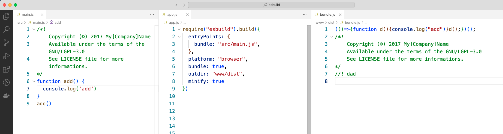
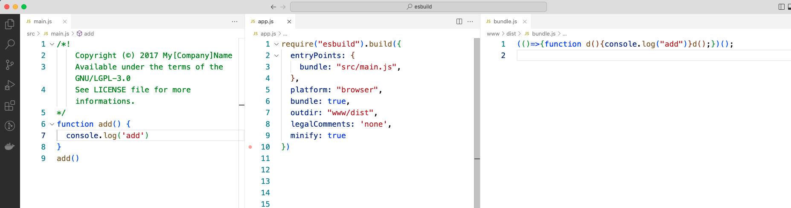
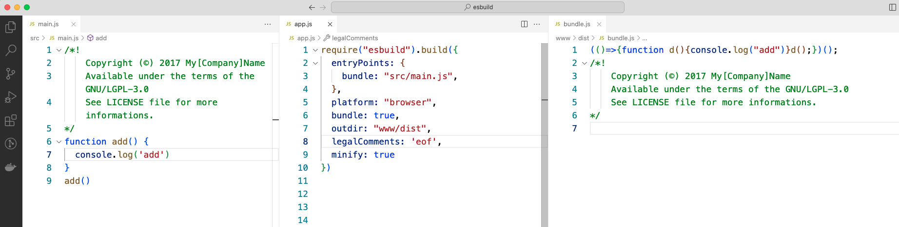
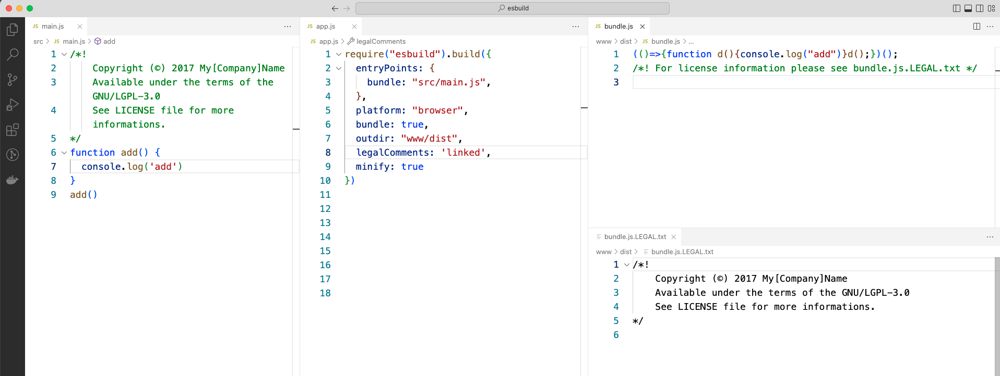
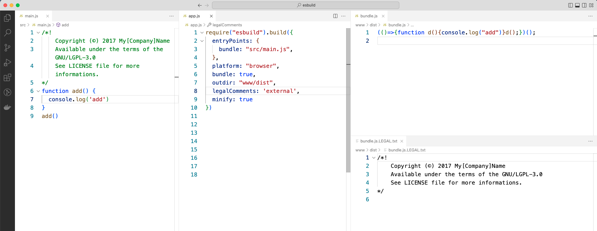

Note that "statement-level" for JS and "rule-level" for CSS means the comment must appear in a context where multiple statements or rules are allowed such as in the top-level scope or in a statement or rule block. So comments inside expressions or at the declaration level are not considered legal comments.(译者注:这段话译者没有找到合适的案例, 因为没搞清楚什么叫表达式内部的注释, 有知道的请 call 我)

### LogLevel

[ build | transform ]

这个选项用来控制 esbuild 的日志输出级别, 这里有六种可用的级别值:

- silent, 不展示任何日志, 使用 transform API 的时候 esbuld 默认使用这个值.
- error, 仅显示错误日志
- warning, 仅显示警告和错误日志, 使用 build API 的时候 esbuld 默认使用这个值
- info, 显示警告、错误和打印和概要日志, 在命令行中执行 esbuild 的时候, 默认使用这个值
- debug, 显示所有日志, 这些日志可以帮助你调试程序, 但是这样可能会影响性能, 而且可能会抛出一些错误的信息.
- verbose, 这个级别的日志会产生大量的日志信息, 包括文件系统的读写操作等等, 通常不建议使用这个值

设置日志输出级别的用法像这样:

```shell
echo 'typeof x == "null"' | esbuild --log-level=error
```

或者

```javascript
let js = 'typeof x == "null"';
require("esbuild").transformSync(js, {
  logLevel: "error",
});
```

### LogLimit

默认情况下, esbuild 会在输出 10 条警告或者错误消息的详细信息后自动停止输出, 这是为了避免在瞬间产生大量日志消息, 进而影响你的终端进程, 如果你的电脑运行慢的话, 很容易被这忽然出现的量日志消息卡住

你可以像下面这样修改这条规则, 也可以设置为 0, 来允许 esbuild 显示所有的日志信息:

```shell
$ esbuild app.js --log-limit=0
```

或者

```javascript
require("esbuild").buildSync({
  entryPoints: ["app.js"],
  logLimit: 0,
  outfile: "out.js",
});
```

#### 译者注

这里的条数限制指的是: 假如你的语法中有三个警告级别的语法错误, esbuild 只会显示指定书目的语法错误信息, 下面有个案例:

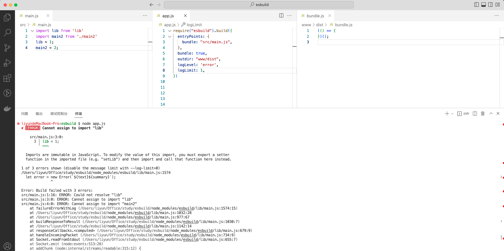

这个案例中, 包含了 3 个错误, 命令行中仅展示了 1 条错误的详细信息, 就是因为译者设置了`logLimit:1`的参数

### LogOverride

[ build | transform ]

这个选项用来修改各种类型消息的日志级别, 你可以在这个选项中消除一些特定类型消息的警告, 或者启用默认情况下未启用的警告, 甚至是将特定消息的消息级别从警告提升到错误类型

比如, 面向旧版本浏览器构建时, esbuild 会把正则表达式字面量, 转为`new RegExp()`构造函数的方式, 这样可以避免正则表达式中使用的某些新的语法被浏览器视为语法错误. 如果你希望 esbuild 在你的正则表达式中包含新的不被支持的语法时生成警告消息, 你可以像这样处理;

```shell
$ esbuild app.js --log-override:unsupported-regexp=warning --target=chrome50
```

或者

```javascript
require("esbuild").buildSync({
  entryPoints: ["app.js"],
  logOverride: {
    "unsupported-regexp": "warning",
  },
  target: "chrome50",
});
```

实际上你可以把下面所有消息类型的日志级别修改为你想要的值, 这里列出了所有当前可用的消息类型(点击箭头可以看到它的实例日志消息案例, 译者这里就不复制粘贴那些案例了, 可以去[英文版](https://esbuild.github.io/api/#log-override)中看):

```
JS:
  assign-to-constant
  assign-to-import
  call-import-namespace
  commonjs-variable-in-esm
  delete-super-property
  duplicate-case
  duplicate-object-key
  empty-import-meta
  equals-nan
  equals-negative-zero
  equals-new-object
  html-comment-in-js
  impossible-typeof
  indirect-require
  private-name-will-throw
  semicolon-after-return
  suspicious-boolean-not
  this-is-undefined-in-esm
  unsupported-dynamic-import
  unsupported-jsx-comment
  unsupported-regexp
  unsupported-require-call

CSS:
  css-syntax-error
  invalid-@charset
  invalid-@import
  invalid-@nest
  invalid-@layer
  invalid-calc
  js-comment-in-css
  unsupported-@charset
  unsupported-@namespace
  unsupported-css-property

Bundler:
  ambiguous-reexport
  different-path-case
  ignored-bare-import
  ignored-dynamic-import
  import-is-undefined
  require-resolve-not-external

Source maps:
  invalid-source-mappings
  sections-in-source-map
  missing-source-map
  unsupported-source-map-comment

Resolver:
  package.json
  tsconfig.json
```

### MangleProps

[ build | transform ]

> 注意: 除非你确切知道这个功能对源代码的影响, 轻易不要使用该选项, 否则可能影响你的项目运行

这个选项允许你设置一个正则表达式作为值, 用来允许 esbuild 自动重命名与这个正则表达式相匹配的"属性名", 如果你想压缩源代码中的某些属性名或者想混淆某些功能的时候, 才需要用到这个选项.

比如你设置了`--mangle-props=_$`, 如果你的代码中有`const person = {name_: 'zhangsan'}`这句话, 它可能会被转换为`const a = {b:'zhangsan'}'`, 你会发现连属性名都被压缩了, 因为属性`name_`与正则表达式`_$`是匹配的. 它的用法是这样的:

```shell
$ esbuild app.js --mangle-props=_$
```

或者

```javascript
require("esbuild").buildSync({
  entryPoints: ["app.js"],
  mangleProps: /_$/,
});
```

在这个案例中, 只有以下划线结尾的属性名, 才会被 esbuild 重新压缩, 这个正则表达式是一个理想的方式, 因为普通的 JS 代码不会包含这样的属性名, 浏览器的 PAI 也更不会使用这种命名方式, 所以这个正则表达式有效避免了对浏览器 API 以及用户其他自定义属性的影响. 如果你想再复杂一些可以使用`[^_]_$`, 它表示要转换的属性名必须以下划线结尾, 且下划线前一个字符必须是非下划线字符.

这个是 esbuild 中单独的功能, 不属于[minify](#minify). 因为它不是一种安全的转化模式, 它仅在你提供了正则表达式的时候, 对匹配正则表达式的属性名做转换. 且它会影响你对此类属性的引用取值, 你将不能使用`obj[prop]`的方式取值, 因为`prop`的名称在打包之后,很有可能不再是以前的字符了.

如果你开启了这个选项, 以下几种类型的属性都将被 esbuild 转换:

| Syntax                           | Example                                             |
| -------------------------------- | --------------------------------------------------- |
| Dot property                     | accesses x.foo\*                                    |
| Dot optional chains              | x?.foo\*                                            |
| Object properties                | x = { foo\*: y }                                    |
| Object methods                   | x = { foo\*() {} }                                  |
| Class fields                     | class x { foo\* = y }                               |
| Class methods                    | class x { foo\*() {} }                              |
| Object destructuring bindings    | let { foo\*: x } = y                                |
| Object destructuring assignments | ({ foo\*: x } = y)                                  |
| JSX element member expression    | <X.foo*></X.foo*>                                   |
| JSX attribute names              | <X foo_={y} />                                      |
| TypeScript namespace             | exports namespace x { export let foo\* = y }        |
| TypeScript parameter             | properties class x { constructor(public foo\*) {} } |

请注意, esbuild 会在每次构建过程中替换所有符合正则表达式的属性名, 而且每次构建过程中所生成的属性名可能是不同的. 所以请尽量避免使用 esbuild 多次构建时重复使用该功能

#### 模板字符串属性

默认情况下, esbuild 不会转换模板字符窜属性名. 这意味着, 如果你不希望某而过属性名被 esbuild 转换, 可以这个属性改为模板字符串类型的属性名.

比如, 正常情况下`const person = {age_: 20}`, 可能会被转换为`const person = {a:20}`, 如果你的源代码中写的是`const person = {"age_": 20}`, esbuild 就不会对`age_`进行转换了

如果你希望 esbuild 对模板字符串类型的属性名也做同样的转换, 可以添加`mangleQuoted:true`参数, 像这样:

```shell
$ esbuild app.js --mangle-props=_$ --mangle-quoted
```

或者

```javascript
require("esbuild").buildSync({
  entryPoints: ["app.js"],
  mangleProps: /_$/,
  mangleQuoted: true,
});
```

当你开启了`mangleQuoted:true`选项, esbuild 将会转换以下代码中的属性名:

| Syntax                                  | Example                  |
| --------------------------------------- | ------------------------ |
| Quoted property accesses                | x['foo_']                |
| Quoted optional chains                  | x?.['foo_']              |
| Quoted object properties                | x = { 'foo\_': y }       |
| Quoted object methods                   | x = { 'foo\_'() {} }     |
| Quoted class fields                     | class x { 'foo\_' = y }  |
| Quoted class methods                    | class x { 'foo\_'() {} } |
| Quoted object destructuring bindings    | let { 'foo\_': x } = y   |
| Quoted object destructuring assignments | ({ 'foo\_': x } = y)     |
| String literals to the left of in       | 'foo\_' in x             |

#### 保留某些属性的名称

如果你想在 esbuild 的这项功能里, 单独保留某些符合特定规则的属性名, 可以使用`reserveProps`选项, 它的值也是一个正则表达式, 像这样:

```shell
$ esbuild app.js --mangle-props=_$ "--reserve-props=^__.*__$"
```

或者

```javascript
require("esbuild").buildSync({
  entryPoints: ["app.js"],
  mangleProps: /_$/,
  reserveProps: /^__.*__$/,
});
```

#### 自定义重命名规则

esbuid 对属性重命名的功能提供了一些更高级的用法, 当它的高级功能启用后, 可以带来以下好处:

- 把文件交给 esbuild 构建时, 你可以自定义重命名过程中对指定属性名的重命名规则
- 你可以通过对比自定义的重命名规则, 来查看构建结果是否正确
- 你可以将某些属性名的值设为 false, 来禁用单个属性的重命名功能

比如下面这个案例:

```javascript
console.log({
  someProp_: 1,
  customRenaming_: 2,
  disabledRenaming_: 3,
});
```

如果你希望`someProp_`属性正常使用 esbuild 的属性重命名功能, `customRenaming_`属性指定被重命名为`cR_`, `disabledRenaming_`属性禁止使用属性重命名功能的话, 你可以把下面的内容传递给 esbuild

```json
{
  "customRenaming_": "cR_",
  "disabledRenaming_": false
}
```

完整用法像这样:

```javascript
let result = require("esbuild").buildSync({
  entryPoints: ["app.js"],
  mangleProps: /_$/,
  mangleCache: {
    customRenaming_: "cR_",
    disabledRenaming_: false,
  },
});

console.log("updated mangle cache:", result.mangleCache);
```

此时, 你就可以在打包文件中发现它已经按照我们的预期构建了

```javascript
console.log({
  a: 1,
  cR_: 2,
  disabledRenaming_: 3,
});
```

译者案例

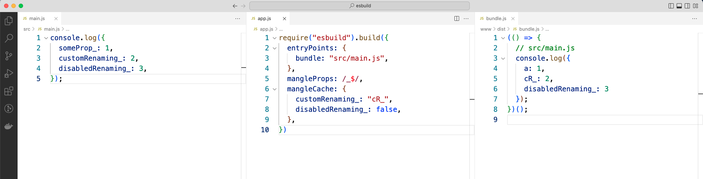

### NodePaths

[ build ]

Node 环境再解析模块时, 除了在项目根目录的`node_modules`文件夹中查找之外, 还会在环境变量`NODE_PATH`对应的目录中搜索模块. 你可以给 esbuild 传递一个数组, 告诉 esbuild 可以在指定的目录中搜索模块, 就像这样:

```shell
$ NODE_PATH=someDir esbuild app.js --bundle --outfile=out.js
```

或者

```javascript
require("esbuild").buildSync({
  nodePaths: ["someDir"],
  entryPoints: ["app.js"],
  bundle: true,
  outfile: "out.js",
});
```

如果你使用命令行模式的时候希望传递多个目录给 esbuild, 在 Unix 系统中, 你需要使用`:`来分隔多个路径, 在 Windows 中, 你需要使用`;`来分隔多个路径

### PreserveSymlinks

[ build ]

这个设置类似于[webpack 中的 resolve.symlinks](https://webpack.js.org/configuration/resolve/#resolvesymlinks), 如果你需要启用这个功能, 可以像这样:

```shell
$ esbuild app.js --bundle --preserve-symlinks --outfile=out.js
```

或者

```javascript
require("esbuild").buildSync({
  entryPoints: ["app.js"],
  bundle: true,
  preserveSymlinks: true,
  outfile: "out.js",
});
```

啥意思呢? 默认情况下, esbuild 在处理软连接文件时, 会自动追踪它的元文件路径, 如果多个软连接指向了同一个原文件, esbuild 只会打包一份源文件的代码, 就像这样(下面的案例中, `lib-link1.js`与`lib-link2.js`都是软链接文件, 指向`lib.js`文件):

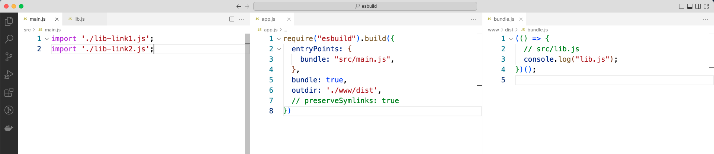

如果你启用了这个选项, esbuild 不会用原文件路径来确定文件的身份了, 这样就可能导致 esbuild 把同一份文件打包两次, 结果像这样:


### PublicPath

[ build ]

当你的项目中引入文件时, 这个选项是很有用的 . 默认情况下, esbuild 会自动给引入的外部文件重命名, 这用这个选项, 可以批量给新的名称前加上自定义的基本路径, 下面是用法:

```shell
$ esbuild app.js --bundle --loader:.png=file --public-path=https://www.example.com/v1 --outdir=out
```

或者

```javascript
require("esbuild").buildSync({
  entryPoints: ["app.js"],
  bundle: true,
  loader: { ".png": "file" },
  publicPath: "https://www.example.com/v1",
  outdir: "out",
});
```

译者案例:

没有添加自定义路径的:


添加了自定义路径的:

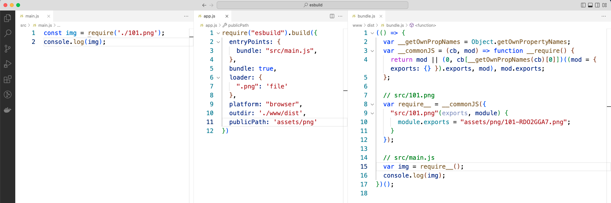

### ResolveExtensions

[ build ]

这个选项用来告诉 esbuild 在解析模块时允许查找的文件扩展名, 默认值为`['.tsx','.ts','.jsx','.js','.css','.json'`. 你可以使用下面的方法自定义这个选项:

```shell
$ esbuild app.js --bundle --resolve-extensions=.ts,.js
```

或者

```javascript
require("esbuild").buildSync({
  entryPoints: ["app.js"],
  bundle: true,
  resolveExtensions: [".ts", ".js"],
  outfile: "out.js",
});
```

esbuild 默认不会包含`.cjs`与`.mjs`的后缀, 因为 node 内部的解析算法也不会处理这两种扩展名的文件. 如果你想导入这两种文件, 需要通过这个选项手动添加这两个扩展名.

### TreeShaking

[ build | transform ]

`Tree Shaking`是构建工具中用于"消除死代码"的术语, "死代码"一般表示的是那些定义了却没有使用的变量、函数或者类声明. 比如下面的入口文件

```javascript
// input.js
function one() {
  console.log("one");
}
function two() {
  console.log("two");
}
one();
```

如果你使用`esbuild --bundle input.js --outfile=output.js`对该文件进行了打包, 输出的文件内容应该是这样的:

```javascript
// out.js
function one() {
  console.log("one");
}
one();
```

即便是把这两个函数放在一个模块文件中通过`export`导出, esbuild 也可以执行 tree shaking 任务, 像这样:

```javascript
// lib.js
export function one() {
  console.log("one");
}
export function two() {
  console.log("two");
}

// input.js
import * as lib from "./lib.js";
lib.one();

// out.js
(() => {
  // src/lib.js
  function one() {
    console.log("one");
  }

  // src/main.js
  one();
})();
```

#### 译者案例

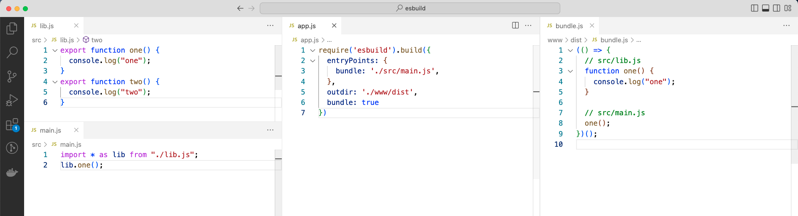

请注意,esbuild 中的 tree shaking 功能依赖于 ECMAScript 模块的导入和导出语句, 不适用于 CommonJS 模块. npm 上的很多包都同时支持这两种模式, esbuild 默认会尝试选择支持 tree shaking 的文件. 当然了你也可以通过[main field](#mainfield)选项或者[Conditions](#conditions)选项选择合适的模式.

默认情况下, 只有启用`--bundle`选项, 且`format=ifee`时, esbuild 才会启用 tree shaking, 否则该功能是关闭的. 你也可以通过以下设置强制开启

```shell
$ esbuild app.js --tree-shaking=true
```

或者

```javascript
require("esbuild").buildSync({
  entryPoints: ["app.js"],
  treeShaking: true,
  outfile: "out.js",
});
```

当然了, 你也可以通过下面的设置, 强制关闭 tree shaking 功能:

```shell
$ esbuild app.js --tree-shaking=false
```

或者

```javascript
require("esbuild").buildSync({
  entryPoints: ["app.js"],
  treeShaking: false,
  outfile: "out.js",
});
```

#### tree shaking and side effects

esbuild 只有在确定某段代码无副作用的时候, 才会安全的移除它们. 比如原始字符串`abcd`与原始数字`1234`是无副作用的, 是可以移除的, 而`'ab'+cd`与`foo.bar`不一定是无副作用的, 这是因为

1. `'ab'+cd`在执行的时候,会隐式执行`cd.toString()`, esbuild 无法确定这个方法有没有副作用, 因为`toString`函数是可以被重写的
2. `foo.bar`执行的时候, esbuild 不知道`bar`是否有定义`getter`函数, 更无法确定`getter`函数中是否有副作用

有时候几遍无法确定某处代码有没有副作用, 你也希望对此处代码进行 tree shaking, 可以通过`/* @__PURE__ */`或者`/* #__PURE__ */`标记告诉 esbuild 此处代码是无副作用的, 如果没有被使用就可以被移除. 但是一定要记得, 这种标记必须放在函数调用之前, 像这样:

```javascript
// 这里的注释标记, 就告诉了esbuid如果 fammmaTable未被使用, 可以直接把当前语句移除
let gammaTable = /* @__PURE__ */ (() => {
  // Side-effect detection is skipped in here
  let table = new Uint8Array(256);
  for (let i = 0; i < 256; i++)
    table[i] = Math.pow(i / 255, 2.2) * 255;
  return table;

```

虽然这种标记只能应用于表达式, 且会导致代码变得更长, 但这种语法同时被多种构建工具支持, 包括流行的`UglifyJS`,`Terser`等等.

需要注意的是, 这种注释会导致 esbuild 认为你的语句是无副作用的, 如果你不小心在某些语句上使用了错误的注解, 可能致你的项目运行失败, 如果出现这种情况, 你可以考虑使用[Ignore annotation](#ignoreannotations)选项,来忽略此类注释

### TsConfig

[ build ]

通常 esbuild 会自动查找项目中的`tsconfig.json`文件, 但是你也可以手动指定该文件的路径, 当你需要使用不同的配置来运行多次构建时,这个选项是很有用的, 用法像这样:

```shell
$ esbuild app.ts --bundle --tsconfig=custom-tsconfig.json
```

或者

```javascript
require("esbuild").buildSync({
  entryPoints: ["app.ts"],
  bundle: true,
  tsconfig: "custom-tsconfig.json",
  outfile: "out.js",
});
```

### TsConfigRow

[ transform ]

一般来说, 只有当你不能访问文件系统中的`tsconfig.json`文件时, 才会这个选项用来传递 Typesscript 的配置项给 [transform api](#transform-api):

```shell
$ echo 'class Foo { foo }' | esbuild --loader=ts --tsconfig-raw='{"compilerOptions":{"useDefineForClassFields":true}}'
```

或者

```javascript
let ts = "class Foo { foo }";
require("esbuild").transformSync(ts, {
  loader: "ts",
  tsconfigRaw: `{
    "compilerOptions": {
      "useDefineForClassFields": true,
    },
  }`,
});
```

### WorkDirectory

[ build ]

该选项用来告诉 esbuild 构建任务的工作目录, 默认情况下, 工作目录指向调用 esbuild 进程的当前目录. 如果你设置了该选项, 调用[build api](#build-api) 的时候所有与路径相关的, 都会使用这个目录作为基础路径.用法如下:

或者

```javascript
require("esbuild").buildSync({
  entryPoints: ["file.js"],
  absWorkingDir: "/var/tmp/custom/working/directory",
  outfile: "out.js",
});
```

需要注意的是, 这个选项的值必须是一个绝对路径.

如果你的项目使用了[Yarn Plug'n Play](https://yarnpkg.com/features/pnp), 必须把该选项的值设为`.pup.js`文件所在的目录, 否则可能导致 esbuild 找不到对应的模块

### JSX

[ build | transform ]

这个选项用来告诉 esbuild 如何处理源代码中的 JSX 语句, 支持以下几种处理方案:

#### transform

默认值, 该值告诉 esbuild 把 JSX 转换成 JS 语句, 每个 JSX 元素都被转换为一个工厂函数, 并且把根元素的元素名作为第一个参数, 第二个参数用来保存元素的属性, 从第三个参数开始用来保存子元素(千万记得要使用`{loader: ".js":"jsx"}`加载器, 否则会报错), 像这样:

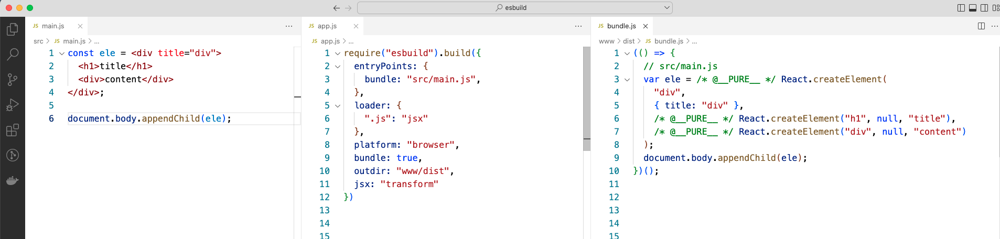

#### preserve

该值告诉 esbuild, 保留 JSX 语法, 不用将它们转换为函数调用. 如果你需要在 esbuild 打包之后,再使用其他工具处理文件中的 JSX 语法时, 可以使用这个功能

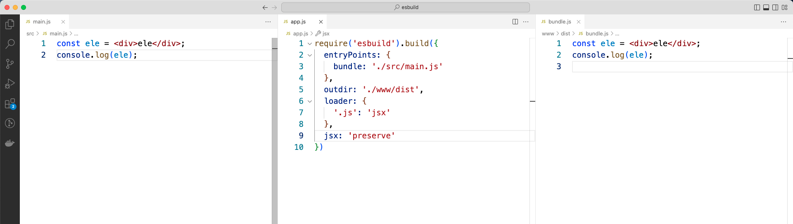

#### automatic

这个模式对于 React17 开始的版本是很有用的,属于 React 特有的模式, 它会自动引入最新的如何处理 JSX 语法的方案. 细节这里就不描述了, 可以去阅读[React 关于 JSX 语法转换](https://reactjs.org/blog/2020/09/22/introducing-the-new-jsx-transform.html)的文档, 如果要使用这种模式, 需要额外启用[JSX dev](#jsxdev)选项,(这里译者提供一篇写的还不错的[关于新的 JSX 语法转换](https://blog.csdn.net/wu_xianqiang/article/details/113852077)的文档)

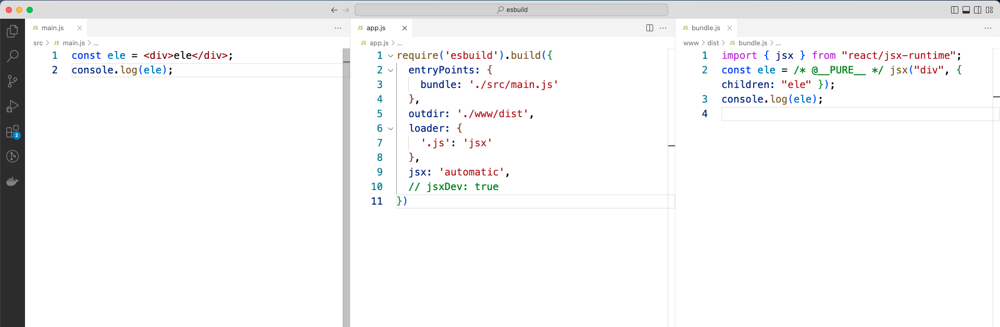

> 译者注: 此值与其他两种的区别就在于, 使用此值时, 将使用 React17 版本开始提供的 JSX 转换语法来解析 JSX 语句, 从上面三个译者案例的`bundle.js`文件中就可以看出来.

### JsxDev

[ build | transform]

当[JSX](#jsx)选项的值设置为`automatic`时, 该选项会允许 esbuild 自动把文件名与位置等信息注入每个 JSX 语句, 主要为了方便调试 JSX 语句. 如果[JSX](#jsx)选项的值为其他值, 该选项是无效的. 用法如下:

```shell
$ echo '<a/>' | esbuild --loader=jsx --jsx=automatic
# import { jsx } from "react/jsx-runtime";
# /* @__PURE__ */ jsx("a", {});

$ echo '<a/>' | esbuild --loader=jsx --jsx=automatic --jsx-dev
# import { jsxDEV } from "react/jsx-dev-runtime";
# /* @__PURE__ */ jsxDEV("a", {}, void 0, false, {
#   fileName: "<stdin>",
#   lineNumber: 1,
#   columnNumber: 1
# }, this);
```

或者

```javascript
require("esbuild").buildSync({
  entryPoints: ["app.jsx"],
  jsxDev: true,
  jsx: "automatic",
  outfile: "out.js",
});
```

#### 译者案例

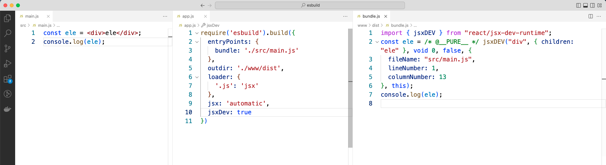

### JSX Factory

[ build | transform ]

> 译者注: 此选项仅在[jsx](#jsx)设置非`automatic`时可用

这个选项用来设置 JSX 语句转换为 Javascript 表达式的执行函数.默认情况下, esbuild 会使用`React.createElement()`来转换 JSX 语句, 像这样:

```javascript
// input.js
<div>Example text></div>;

// bundle.js
React.createElement("div", null, "Example text");
```

你可以通过这个选项自定义执行函数的名称, 比如:

```shell
$ echo '<div/>' | esbuild --jsx-factory=h --loader=jsx

# /* @__PURE__ */ h("div", null);
```

或者:

```javascript
require('esbuild').transformSync('<div/>', {
  jsxFactory: 'h',
  loader: 'jsx',
})
{
  code: '/* @__PURE__ */ h("div", null);\n',
  map: '',
  warnings: []
}
```

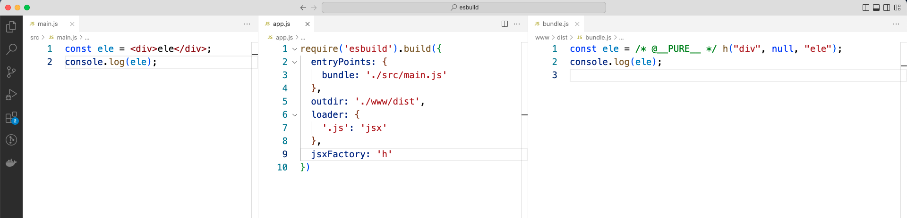

如果你在 `tsconfig.json` 中设置了如下配置, 那么 esbuild 会自动读取这里的配置, 就不需要再次配置`jsx-factory`参数了

```json
{
  "compilerOptions": {
    "jsxFactory": "h"
  }
}
```

如果你只希望某单个文件内的 JSX 使用自定义执行函数, 可以在文件头部添加`// @jsx h`注释. 像这样:

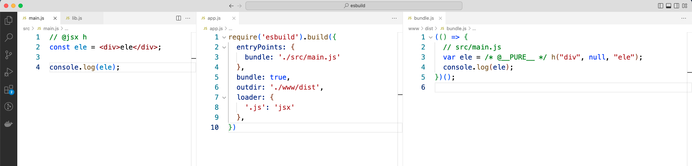

> 译者注: 在文件头部添加注释的方式, 只会作用于当前文件, 不会影响其他文件, 比如下面的译者案例中, `main.js`中的 JSX 语法使用了`h`作为执行函数, 而`lib.js`中的 JSX 语法依然使用的`React.createElement()`作为执行函数

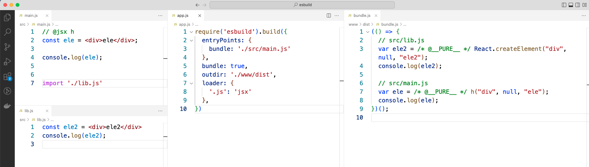

### JSX Fragment

[ build | transform ]

这个选项用来设置 [JSX Fragment](https://beta.reactjs.org/apis/react/Fragment#usage)的替代组件, 默认情况下, esbuild 使用`React.Fragment`作为空白元素的根组件, 像这样:

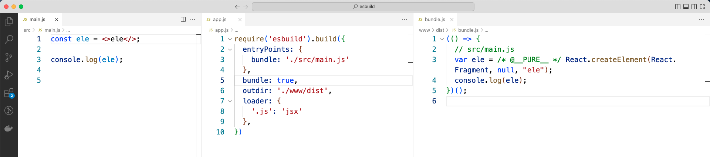

你可以通过该选项把`React.Fragment`替换为其他组件, 比如`Preact`提供的`Fragment`组件:

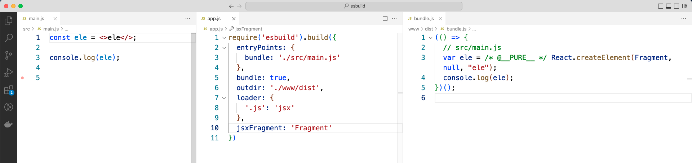

如果你在 `tsconfig.json` 中设置了如下配置, 那么 esbuild 会自动读取这里的配置, 就不需要再次配置`jsx-fragment`参数了

```json
{
  "compilerOptions": {
    "jsxFragmentFactory": "Fragment"
  }
}
```

如果你只希望某单个文件内的 JSX 使用自定义执行函数, 可以在文件头部添加`// @jsxFrag Fragment`注释. 像这样:
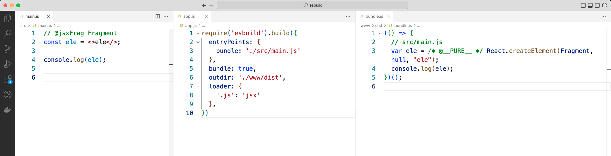

> 译者注: 和[jsx factory](#jsx-factory)一样, 文件头部的注释仅影响所在文件, 这里就不再写案例了

### JSX Import Source

[ build | transform ]

如果你的[jsx](#jsx)选项设置为`automatic`, 当前选项可以让 esbuild 自动从指定的库中导入 jsx 的辅助函数库. 请注意, 这项功能仅适用于 React17 及之后的版本, 且配置该选项时, 指定的的库必须公开以下导出项:

```javascript
import { createElement } from "your-pkg";
import { Fragment, jsx, jsxs } from "your-pkg/jsx-runtime";
import { Fragment, jsxDEV } from "your-pkg/jsx-dev-runtime";
```

The /jsx-runtime and /jsx-dev-runtime subpaths are hard-coded by design and cannot be changed. The jsx and jsxs imports are used when JSX dev mode is off and the jsxDEV import is used when JSX dev mode is on. The meaning of these is described in React's documentation about their new JSX transform. The createElement import is used regardless of the JSX dev mode when an element has a prop spread followed by a key prop, which looks like this: ( 译者注: 这段话实在找不到可用的案例, 大致理解为: 当你开启了`jsxDev`选项时, esbuild 会使用`jsxDEV`作为渲染函数, 关闭`jsxDev`选项, esbuild 会使用`jsx`或者`jsxs`作为渲染函数)

```javascript
return <div {...props} key={key} />;
```

下面是使用`preact`的方法:

```shell
$ esbuild app.jsx --jsx-import-source=preact --jsx=automatic
```

或者

```javascript
require("esbuild").buildSync({
  entryPoints: ["app.jsx"],
  jsxImportSource: "preact",
  jsx: "automatic",
  outfile: "out.js",
});
```

如果你的`tsconfig.json`文件中已经设置了下面的选项 , esbuild 将自动读取该配置:

```json
{
  "compilerOptions": {
    "jsx": "react-jsx",
    "jsxImportSource": "preact"
  }
}
```

如果你只想针对单独的文件使用词设置 可以在文件头部添加`// @jsxImportSource your-pkg`注释, 此方式与[jsx factory](#jsx-factory)与[jsx-fragment](#jsx-fragment)功能一样, 只会影响其所在文件

### JSX Side Effects

[ build | transform ]

默认情况下, esbuild 认为所有的 JSX 语句都是无副作用的, 构建过程中, 如果没有被使用, 也会被移除掉, 大多数的 JSX 表达式都是符合这个规则的. 但是某些包的 JSX 语句没有遵循这个规则, 导致构建后的打包文件运行异常. 如果你使用了这种不规范的包, 可以使用这个选项告诉 esbuild 不再移除无副作用的 JSX 语句:

```shell
esbuild app.jsx --jsx-side-effects
```

或者

```javascript
require("esbuild").buildSync({
  entryPoints: ["app.jsx"],
  outfile: "out.js",
  jsxSideEffects: true,
});
```

## Format Message API

这个功能主要是用来在控制台打印错误或者警告日志. 这个 API 中可以自定义显示的错误信息, 文件名, 行数, 颜色等等

译者案例:


使用这个 API 的时候, 可以传递下面这几个参数:

```javascript
interface FormatMessagesOptions {
  kind: "error" | "warning";
  color?: boolean;
  terminalWidth?: number;
}
```

- kind, 设置消息的类型, 包含两种值:`warning`和`error`
- color, 如果设置为 true, 输出的消息内容会自动添加颜色标记
- terminalWidth, 设置输出内容的最大宽度, 超出这个宽度会自动换行, 如果设置为`0`表示禁止自动换行

## JS 中要注意的地方

esbuild 提供的某些 API 提供了同步和异步两种方式, 您需要了解这两种方式之间的差异, 来确保使用正确的 API

### 同步 API

同步 API 会立即返回其执行结果, 比如下面这些:

```javascript
let esbuild = require("esbuild");
let result1 = esbuild.transformSync(code, options);
let result2 = esbuild.buildSync(options);
```

优点:

- 可以使你的代码更简洁
- 在需要同步操作的时候, 可以用到它们

缺点:

- 不能与某些[插件](#plugins)一起使用, 因为插件都是异步的
- 会阻塞当前线程, 在执行期间, 无法同时执行其他工作
- 使用的时候, esbuild 不能并行调用

### 异步 API

异步 API 通常会返回一个 Promise, 像下面这些:

```javascript
let esbuild = require('esbuild')
esbuild.transform(code, options).then(result => { ... })
esbuild.build(options).then(result => { ... })
```

优点:

- 可以使用自带异步属性的[Plugin](#plugin)
- 不会阻塞当前线程, 可以同时执行其他工作
- 可以同时并行运行多个 esbuild 任务, 可以更好的利用你的 CPU 性能

缺点:

- 如果 Promise 嵌套太多, 可能会导致代码更混乱, 比如在 CommonJS 中规定顶级作用域下不允许使用`await`语法糖
- 当你的项目必须使用同步 API 的时候, 是不能使用异步 API 的

## 在浏览器中运行

esbuild 支持在浏览器中运行打包任务, 当你需要时, 需要安装`esbuild-wasm`包, 而不是`esbuild`包

```shell
$ npm install esbuild-wasm
```

在浏览器中打包的 API 和你在 Node 环境中打包是很相似的, 只是你需要在构建之前先执行`initialize()`. 还需要把 esbuild 的 web 打包二进制文件地址, 作为参数传递给`initialize()`. 同步版本的 API 也稍微有点不同. 基本的用法像这样:

```javascript
let esbuild = require('esbuild-wasm')

esbuild.initialize({
  wasmURL: './node_modules/esbuild-wasm/esbuild.wasm',
}).then(() => {
  esbuild.transform(code, options).then(result => { ... })
  esbuild.build(options).then(result => { ... })
})
```

`initialize()`旨在创建一个 Worker 然后运行构建, 如果你已经在 Web Worker 中运行了, 可以传入`worker:false`参数进去, 来避免 esbuild 创建一个新的 worker

你也可以直接引入`esbuild-wasm`中的`browser.min.js`文件来使用构建功能, 像这样:

```javascript
<script src="./node_modules/esbuild-wasm/lib/browser.min.js"></script>
<script>
  esbuild.initialize({
    wasmURL: './node_modules/esbuild-wasm/esbuild.wasm',
  }).then(() => { ... })
</script>
```

如果你需要使用 ECMAScript 模块, 可以像这样使用:

```javascript
<script type="module">
  import * as esbuild from './node_modules/esbuild-wasm/esm/browser.min.js'

  esbuild.initialize({
    wasmURL: './node_modules/esbuild-wasm/esbuild.wasm',
  }).then(() => { ... })
</script>
```
